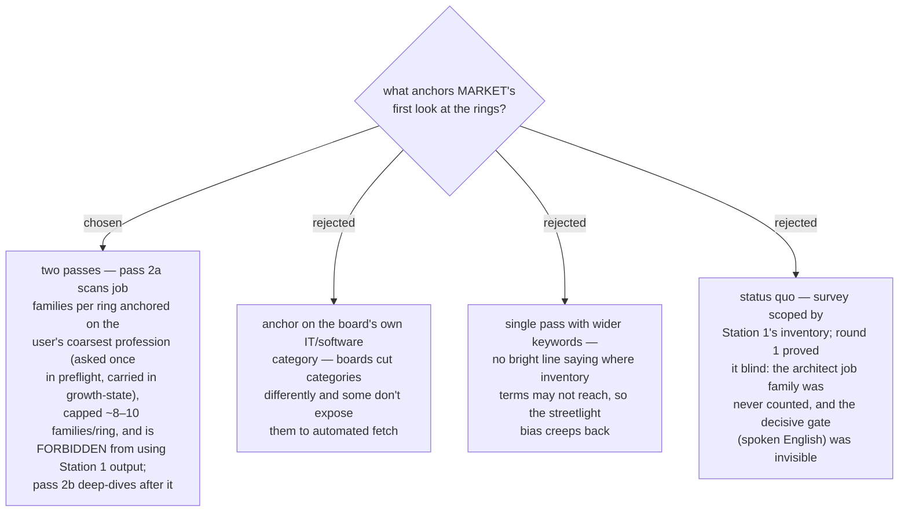

# MARKET runs two passes; pass one is a profession-anchored, inventory-blind job-family scan

Round 1 of `career-growth` surveyed only keywords grown from the inventory and
missed the job family that round 2 showed mattered most (Business Applications
architect, Ring 3) along with its real gate (client-facing spoken English) —
the streetlight effect was structural, not an execution error. Station 2 now
runs two passes: **pass 2a** enumerates the job families per ring anchored
only on the user's coarsest profession, reads what each family gates on, and
may not consume Station 1's output; **pass 2b** is the scoped deep-dive
(scope settled by a subsequent ADR). The families cap keeps MARKET a
single-session stage (ADR 0047's constraint) — when the cap truncates, the
dropped families are named in `market-report.md`, never silently.

- Amends the Station 2 internals of ADR 0045/0048; ADR 0047's ring set and
  single-session bound are unchanged.
- New preflight input: the coarsest profession, asked once and carried in
  `growth-state.md` (contract change ADR'd separately).
