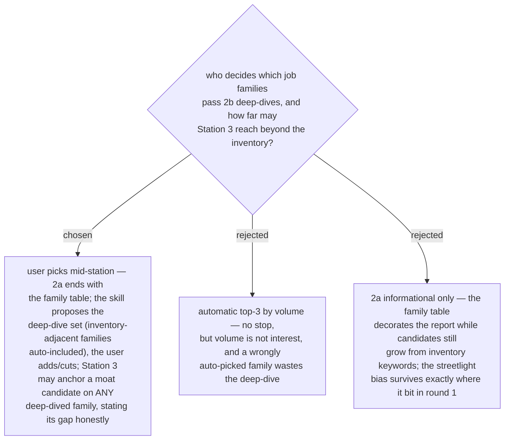

# Pass 2b's scope is user-confirmed mid-station; moat candidates may anchor on any deep-dived family

Pass 2a's family table is only worth its cost if it can change what Station 3
proposes. The user confirms the deep-dive set mid-station (the same light
touchpoint pattern as confirming rings in preflight): inventory-adjacent
families enter automatically, the user adds or cuts the rest. Station 3 may
then anchor a moat candidate on any deep-dived family — including one the
inventory barely touches — provided the candidate states its gap plainly
(round 2's example: an architect-anchored candidate whose gap is spoken
English + lead delivery, proposed to a person whose inventory says developer).

- Extends workflow-daily-work-0148; the Station 4 approval gate (ADR 0045) is
  unchanged — a family-anchored candidate is still only a candidate.
