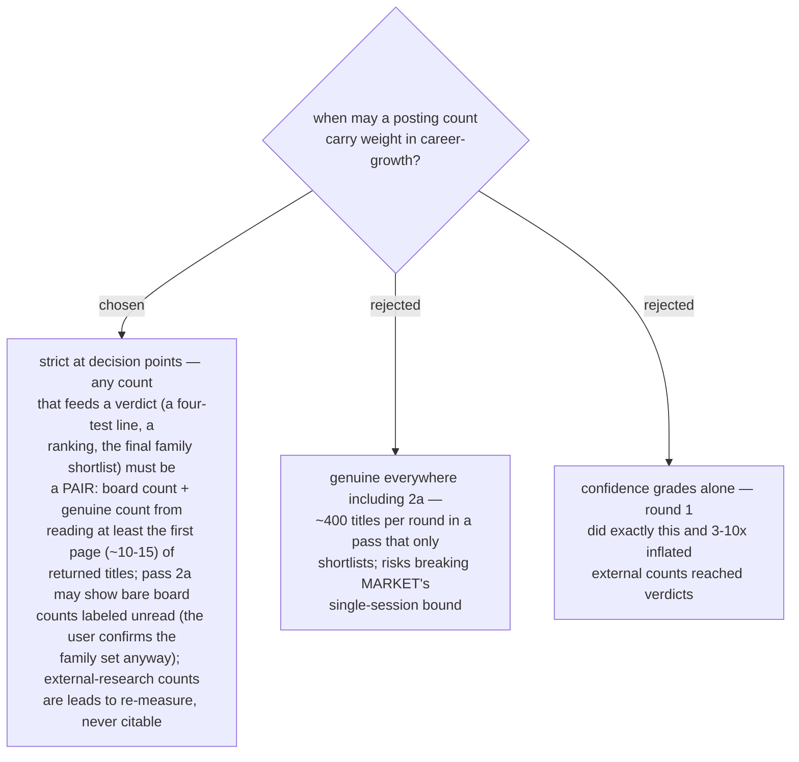

# A verdict-bearing count must be a board+genuine pair; unread and external counts bear no verdicts

Round 2 measured the failure both ways: a board count of 4 held 0 genuine
architect postings, and every reproducible external-run count was 3–10x high.
This becomes **evidence rule 5** in the skill: *a count may support a verdict
only as a board+genuine pair; a count labeled `unread` may inform but never
decide; an `[External-research]` count is a lead, not a count.* The reading
method (first page, on-topic titles only, record both integers and the date)
lives in `references/market-sources.md`. The Gemini Deep Research workflow
survives intact — it supplies leads and coverage; the deciding integers are
measured locally.

- Tightens ADR 0048's grading rules with a counting rule; grades still apply.
- Cost is bounded: genuine reads happen only in pass 2b and wherever a number
  is about to justify a verdict.
