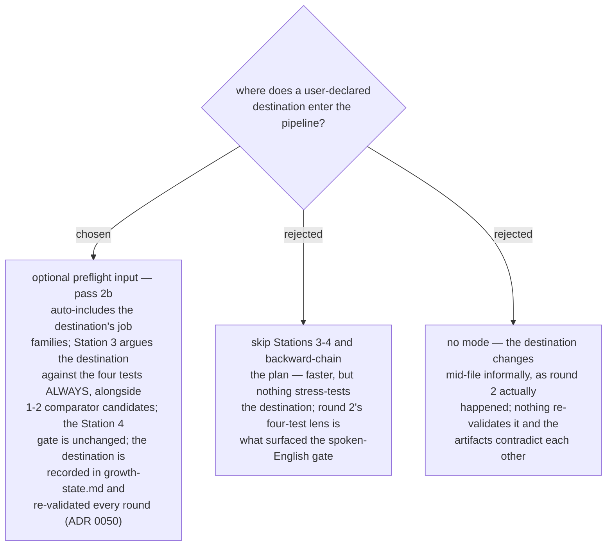

# A declared destination enters Station 3 as a mandatory candidate, never as a shortcut past the gate

Round 2 ran destination-first de facto ("Solution Architect, Bangkok, BA
stack") and the skill had no seat for it — the question changed mid-file. The
destination becomes an optional preflight input (pre-filled from the previous
round's `growth-state.md`): it forces its job families into pass 2b's
deep-dive set, must be argued against the four tests in Station 3 next to at
least one comparator, and stands or falls at the Station 4 gate like any
candidate — the user may confirm it against a failing verdict, but the skill
never silently swaps it. Recorded in `growth-state.md` (contract change ADR'd
separately) so every later round re-validates rather than re-derives it.

- Preserves ADR 0045's gate and ADR 0050's full-run rule; extends
  workflow-daily-work-0148/0149's pass structure.
