# PLAN is gate-driven: milestone lanes come from measured family gates; a cert must state its justification

```mermaid
flowchart TD
    Q{"what drives Station 5's plan?"} -->|chosen| G["gate-driven lanes — growth-plan.md opens
with the measured gates of the chosen moat /
declared destination (from pass 2b's
requirement-text reads); every gate gets a
lane with a pass/fail milestone; a cert may
enter only with a stated justification:
(a) an institution/ring demonstrably reads it,
or (b) it forces capability the readiness
check graded unknown; the readiness/ranking
machinery (ADR 0148-era items 1-3) survives
intact INSIDE the cert lane; zero-study-hour-
first extends to every lane"]
    Q -->|rejected| L["cert-driven plus a language special case —
minimal edit, but the next non-cert gate
(domain portfolio, lead delivery) hits the
same wall again"]
    Q -->|rejected| S["keep ADR 0051 as is — round 2 measured
zero cert mentions across every Ring 1
posting read, and the decisive gate (spoken
English) is not closable by any cert"]
```

Round 2's findings contradict ADR 0051's headline: Ring 1 employers named no
Microsoft cert in any posting read, a cert's real value there is partner-
designation arithmetic plus forced capability, and the binding gate on the
declared destination is client-facing spoken English. Station 5 therefore
plans **by lane**: each measured family gate (language, certificate,
published work, employer/partner arithmetic, domain evidence) becomes a lane
with a pass/fail milestone. Certs are one lane and each planned cert carries
its (a)/(b) justification in `growth-plan.md`. Non-cert lanes get the same
measurement discipline the cert lane already has — a language lane needs a
measured baseline (the analogue of "a practice assessment outranks any
estimate"), never a self-impression.

- **Supersedes ADR 0051 in part**: the "PLAN is cert-driven" framing falls;
  the exam-objective-backwards mini-project design and publish-when-feasible
  rule survive unchanged inside the cert lane.
- Zero-study-hour milestones still list first — now across all lanes.
