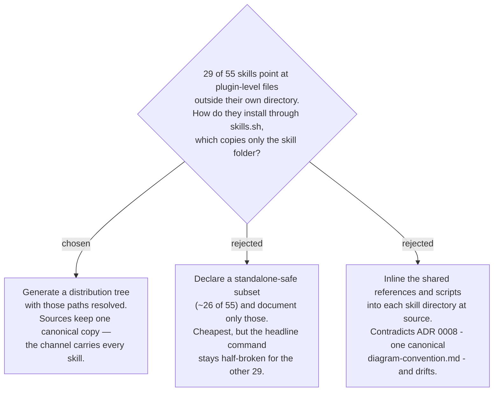

# Every skill installs standalone via `npx skills`, from a generated tree

`npx skills@latest add ThodsaphonSonthiphin/workflow-daily-work` already works today
without any repo change: the skills.sh CLI reads `.claude-plugin/marketplace.json`, and a
probe on 2026-08-29 found 53 skills. What does **not** work is what the skills do once
copied. Measured in the same probe: the CLI copies the skill directory and nothing else,
so plugin-level `references/` and `scripts/` never arrive, and **29 of the 55 skills**
resolve a `${CLAUDE_PLUGIN_ROOT}/references/...` or `.../scripts/...` path that is not
there — `grill-then-plan`, `daily`, `sa-doc`, `debug-mantra`, both backlog pipelines and
both decision-map skills among them. Nothing errors; the skill simply reads an
instruction pointing at a file that does not exist.

The decision is that this channel is held to the same bar as the plugin: **every** skill
installs and works, not a subset that happens to be self-contained. The mechanism is a
generated distribution tree in which those paths are already resolved — the same shape
`plugins/dev-workflows/.antigravity/install-antigravity.py` already uses for the harness
with the same limitation, rather than a second idea invented for this one. Where that
tree lives, and what keeps it from drifting from its sources, are separate decisions.

Option B was rejected on the user's own framing: the ask is that the skills install
easily, not that some of them do. Option C was rejected because it moves the shared
files into ~20 skill directories, which is precisely the duplication ADR 0008 closed.
