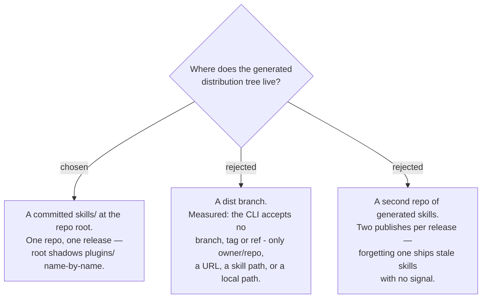

# The generated tree is a committed `skills/` directory at the marketplace root

Following ADR 0153, the resolved copies live in `skills/` at the marketplace root, are
generated, and are committed. Two measurements decided it. First, a fixture probe on
2026-08-29 put the same skill name in both `skills/<name>/` and
`plugins/
/skills/<name>/`: the CLI reported **one** skill, taking the root copy, while
a name present only under `plugins/` still appeared. Root therefore *shadows* the plugin
sources name-by-name rather than duplicating them — so the generated tree becomes what
skills.sh serves, while `/plugin install` keeps reading `plugins/` untouched. Second, the
CLI's documented source formats carry no branch, tag or commit ref, which removes the
option of hiding the tree on a `dist` branch.

The cost accepted: roughly 55 generated directories in git, which must never be
hand-edited, and a drift check between them and their sources. The repo already runs two
checkers of this shape — `check_vendored_superpowers.py` and `check_plugin_copies.py` —
so the mechanism is a third instance of a pattern, not a new one.
