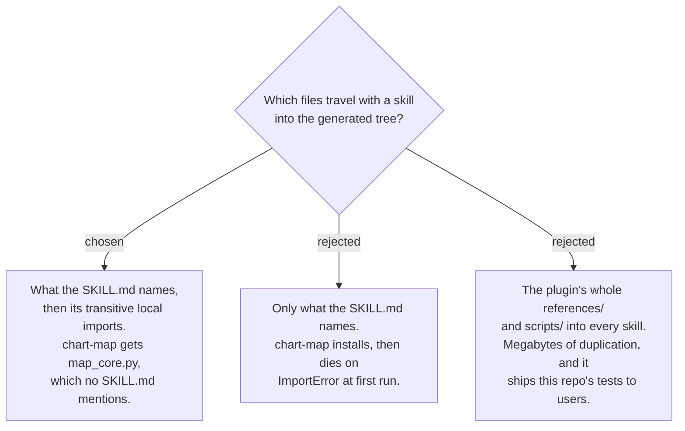

# The generator follows dependencies; it does not copy by directory

The generated tree from ADR 0154 is built per skill, and each skill must stand alone
because `--skill <name>` copies one directory. Copying exactly what a `SKILL.md` names is
not enough: `chart-map` and `work-map` name `scripts/local_map_ops.py` and
`scripts/github_map_ops.py`, and both of those `import map_core` — a module **no SKILL.md
anywhere in the repo mentions**. Naming-only generation therefore produces a skill that
installs cleanly and fails at first run. The generator resolves the named files, then
follows their local imports transitively.

Measured constraints that shape the rule:

- Only Python needs tracing. Every `.cs` and `.ps1` the skills call
  (`create-backlog.cs`, `my-work.cs`, `setup_check.ps1`, `setup_check_github.ps1`) was
  checked for dot-sourcing and `#load`/`#r` directives and has none.
- `test_*` files and `fixtures/` are excluded — they are 196K of 352K in
  `dev-workflows/scripts` and 264K of 572K in `decision-map/scripts`. The exclusion is
  overridden when a SKILL.md names one directly, which `sa-doc` does for
  `scripts/fixtures/sa-model-bookstore.yaml`.
- `${CLAUDE_PLUGIN_ROOT}/...` in `ado-create-work-items` is prose — a tip about quoting
  paths that contain spaces, not a reference. A generator that treats every
  plugin-root token as a path will chase a file named `...`.

No skill references another skill's directory, so the dependency graph has no
skill-to-skill edges to resolve.

Option C was rejected on weight and on shipping this repo's test suite to users.
