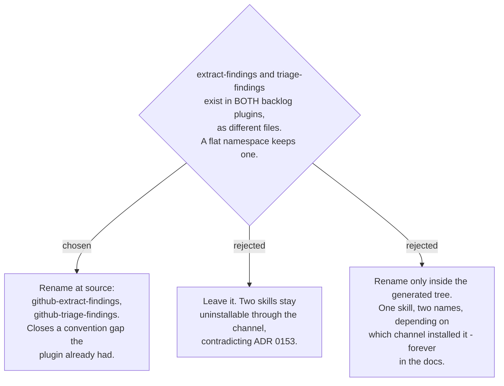

# The colliding github-backlog skills take the prefix their siblings already carry

Measured 2026-08-29: the repo holds 55 skills and the CLI reports 53. `extract-findings`
and `triage-findings` are defined in both `ado-backlog` and `github-backlog` and are
genuinely different files (132 vs 96 lines, 120 vs 82). One of each pair is dropped
silently.

The fix is a source rename on the GitHub side, and it is not a concession to skills.sh.
Five of `github-backlog`'s eight skills already carry the prefix — `github-auth`,
`github-my-work`, `github-create-issues`, `github-writeback-tracking`,
`classify-github-issues` — and the repo already has the exact precedent for which side
keeps the bare name: `my-work` (ADO) against `github-my-work`. The two colliding skills
are simply the two that were left out of their own plugin's convention. ADO keeps the
short names.

Blast radius, measured: about six live files name them — `findings-to-github-issues`,
`github-writeback-tracking`, `classify-github-issues`, `github-backlog/references/data-contracts.md`,
`github-backlog/README.md`, and `docs/ARCHITECTURE.md`. The plans and specs under
`docs/superpowers/` that also mention them are historical records and are not rewritten.
