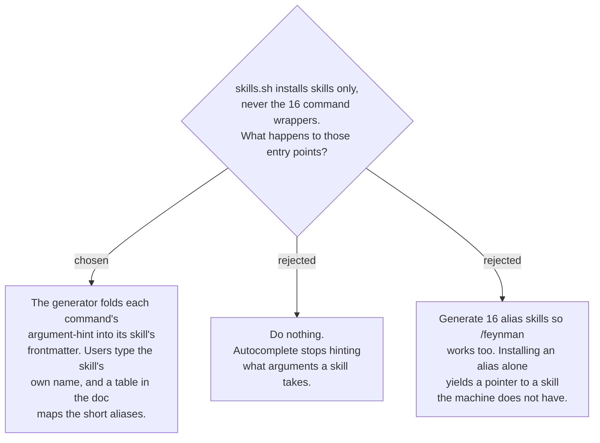

# Generated skills absorb the command's `argument-hint`, not its alias

Claude Code merged custom commands into skills: a skill at `.claude/skills/<name>/` is
invocable as `/<name>`, and `disable-model-invocation: true` blocks only automatic
invocation, not the user typing it. So the npx channel does not lose the ability to
invoke anything — `wait-what` and `document-what-shipped` stay reachable. What it loses
is the *short alias* (`/ask` for `asking-to-understand`, `/feynman` for
`feynman-explain`, `/chart` for `chart-map`, `/run` for `findings-to-ado-backlog`) and
the `argument-hint` that made autocomplete useful.

The hint is worth carrying and costs one frontmatter key; the alias is not worth a
generated skill whose whole body is a pointer, because `--skill <alias>` installs that
pointer on its own and the target is absent. Aliases stay a plugin-channel feature, and
the user-facing document carries the name-mapping table.
