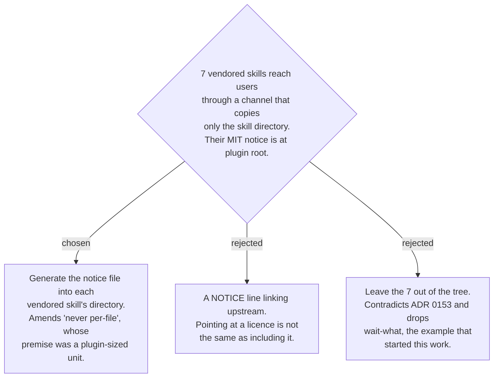

# The vendored MIT notice travels per skill, because the skill is now the unit shipped

Six `sp-*` skills are vendored from obra/superpowers and `wait-what` from
mattpocock/skills, both MIT. The notices live at `plugins/dev-workflows/LICENSE-superpowers`
and `plugins/dev-workflows/LICENSE-mattpocock-skills`, and — measured — **no SKILL.md
references either file**. skills.sh copies the skill directory and nothing above it, so
the generated tree of ADR 0154 would distribute someone else's work with the notice
stripped, against a licence that requires it in "all copies or substantial portions".

The attribution decision on the superpowers-review-to-scrutinize map ruled the notice
ships once per plugin and **never per-file**. That ruling is not overturned; its premise
is. It was made when the plugin was the unit a colleague installed. This channel makes
the *skill* the unit, and a unit that travels alone carries its own notice. The rule
therefore reads: per-plugin in the plugin, per-skill in the generated tree — the
generator writes the right notice file into each of the seven directories, and the
plugin sources keep the single copy they have.
