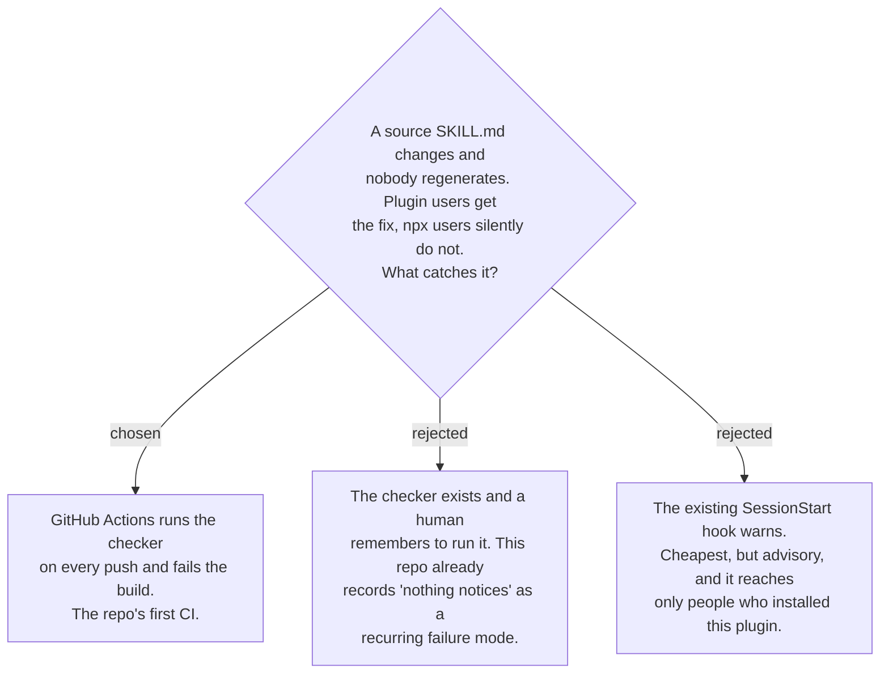

# CI holds the generated tree in sync, not maintainer discipline

The drift is invisible from where it hurts: a user installing through skills.sh gets a
stale skill and has no way to tell. The person who can cause it is exactly one — whoever
pushes — and the check is mechanical. That is a machine's job, not a discipline.

A checker script is required under any option; the decision is only about what runs it.
The repo has no `.github/workflows` today, so this is its first CI, and the same workflow
is the obvious later home for `check_vendored_superpowers.py` and
`check_plugin_copies.py`, which are run by hand for the same reason and carry the same
risk. Two entries in the decision-map fog list already name "nothing notices that
upstream moved" and "nothing notices a routing failure during ordinary use" as open
holes with no CI to hold them; this closes the first instance rather than adding a third.
