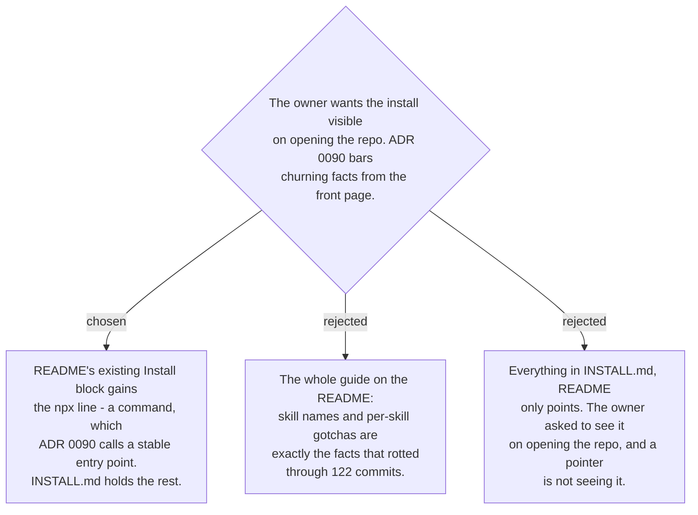

# The front page carries the command; INSTALL.md carries what churns

ADR 0090 is not in tension with showing the command. It sets the front page's audience as
a stranger, puts install "four lines just below" the opening, and bars *skill names,
counts, versions and roadmap status* — the facts measured to have rotted. An install
command is the opposite of that: it names a plugin or a repo, and it changes when the
install mechanism changes, which is the moment someone is editing this anyway.

So the split follows what rots:

- **README** — both channels as copy-pasteable commands, in the Install block that already
  exists on the first screen. No skill names.
- **INSTALL.md** (new, repo root) — choosing between the channels, the `--skill=<name>`
  trap that silently installs everything, the short-alias mapping table, what the npx
  channel does not carry (hooks, aliases, auto-update), the renames from ADR 0156, and the
  per-plugin machine setup.

One consequence worth naming: ADR 0090 refused a CI badge because "a green badge with
nothing behind it is worse than none". ADR 0159 puts something behind it, so the badge
becomes available — and it is a claim about the repo, not a fact that churns.
