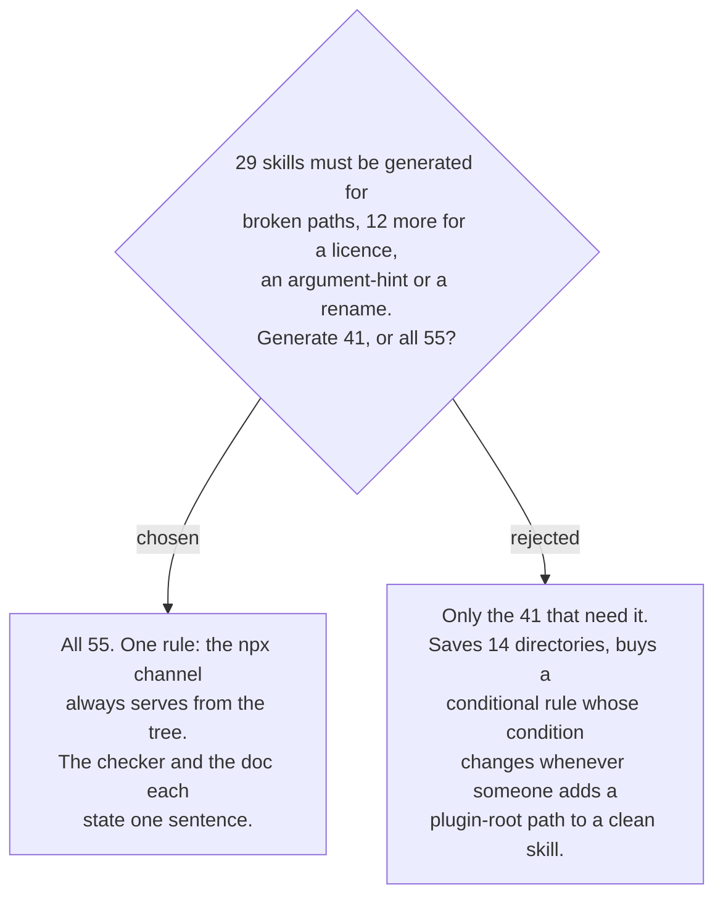

# The generated tree holds every skill, not only the ones that need it

Measured, counting skill directories: of the 55, **29** resolve a plugin-level path and
must be generated. Of the 26 with no such path, **12** must be generated anyway — seven
to carry the vendored MIT notice (ADR 0158), six to absorb a command's `argument-hint`
(ADR 0157) with `wait-what` needing both, and `github-backlog/triage-findings` for the
rename in ADR 0156. So the minimal tree is 41 of 55, saving 14 directories.

Uniformity is worth more than those 14. A partial tree makes membership conditional, and
the condition is a property that changes silently: the day someone adds a
`${CLAUDE_PLUGIN_ROOT}/references/...` line to a skill that was previously self-contained,
that skill must move into the tree, and nothing about the edit says so. That is the same
shape as the drift ADR 0159 exists to catch, reintroduced one level up. With every skill
in the tree, the generator's rule, the checker's rule and the document's explanation are
each a single unconditional sentence.
