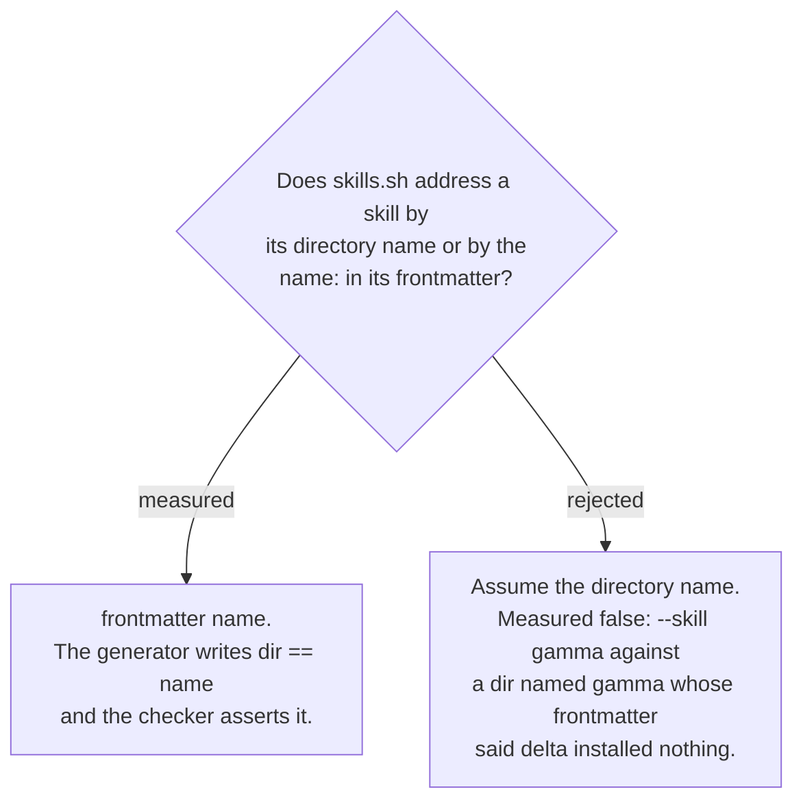

# The frontmatter `name` is the CLI's key, and the generator asserts it

Probed 2026-08-29 on a fixture whose directory was `gamma` and whose frontmatter said
`name: delta`. The listing reported `delta`; `--skill gamma` installed nothing; `--skill
delta` installed it, into `.claude/skills/delta/`. The frontmatter name is both the
selector and the destination directory.

Two consequences the plan depends on:

- The rename in ADR 0156 is a **frontmatter** edit. Renaming the source directories alone
  would leave both twins still answering to `extract-findings`, and the collision intact.
- In the generated tree, a directory whose name differs from its frontmatter `name` is a
  latent bug — the user asks for one string and receives a directory named another. The
  generator writes the two equal, and the ADR 0159 checker asserts it, so a future
  hand-edit to either cannot drift them apart silently.
