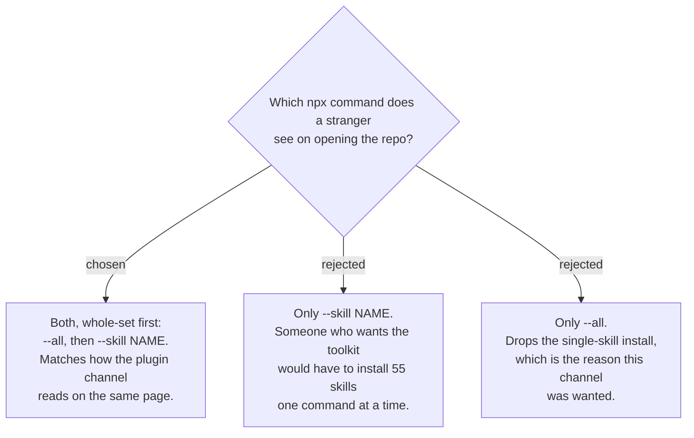

# The front page shows the whole-set command first, then the single-skill form

Requested by the owner: there must be a way to install everything in one command.
Measured the same day — `npx skills@latest add ThodsaphonSonthiphin/workflow-daily-work
--all` installs the whole set (53 today, 55 after ADR 0156's rename) in one run.

`--all` is not decoration. Without it the CLI opens an interactive picker for a human at a
terminal; `--all` is what makes "install everything" a command someone can paste. The
single-skill form keeps its place beside it, because taking one skill into an unrelated
project is what started this work. Both lines sit in the README's existing Install block
per ADR 0160; neither names a skill, so ADR 0090 still holds.
