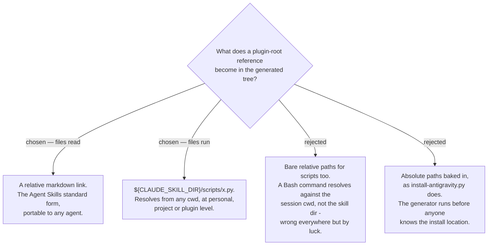

# Read paths go relative; run paths go through `${CLAUDE_SKILL_DIR}`

The first draft of the spec rewrote every plugin-root reference to a path relative to the
skill directory. That is right for files Claude **reads** — `[reference.md](reference.md)`
is the documented Agent Skills pattern — and wrong for files it **runs**: a Bash command
resolves against the session's working directory, which is the user's project root, not
the skill directory. Roughly twenty skills execute a bundled script.

Claude Code substitutes `${CLAUDE_SKILL_DIR}` — the directory containing the `SKILL.md` —
in the skill body and in `allowed-tools` Bash rules, at personal, project **and** plugin
level. It is the one form that is correct in both install channels without knowing the
install path at generation time, and using the same token in both places is what lets a
bundled script run without a permission prompt.

The cost, stated plainly: `${CLAUDE_SKILL_DIR}` is a Claude Code extension, not part of
the Agent Skills standard, so on a non-Claude agent the token reaches the model
unexpanded. This repo's skills target Claude Code and Antigravity, and Antigravity has
its own installer that resolves paths absolutely, so no supported host regresses. A skill
taken into some other agent gets a literal token in a script path instead of a silently
wrong one — a visible failure rather than a hidden one.
