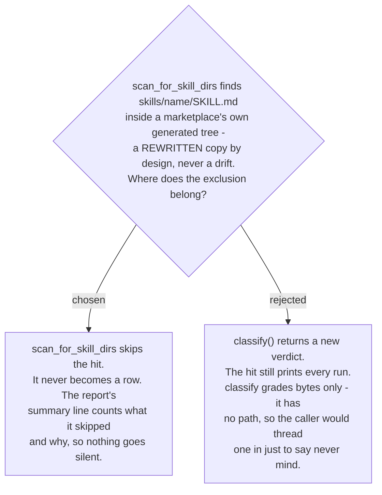

# copy-audit skips the generated tree in the scan, not in classify()

The npx install channel added a generated tree at `skills/` in the marketplace root: one
self-contained directory per skill, built from `plugins/*/skills/` by
`generate_skills_tree.py`, with every plugin-root reference rewritten to a skill-relative
path so the file reads correctly on its own. That rewrite is deliberate - the generated
`SKILL.md` is supposed to differ from its source, and its only repair is regeneration.

`check_plugin_copies.py` never learned that. `scan_for_skill_dirs` finds any directory
named after a known skill that holds a `SKILL.md`; the generated tree matches that shape
at `<marketplace-root>/skills/<name>/SKILL.md` exactly, so every one of its 55 rewritten
files graded against the plugin source and came back STALE or UNRELATED - measured at 18
stale, 1 unrelated on this branch alone - each carrying the repair line for a stray
branch checkout, which is wrong advice for a tree nobody should hand-edit.

The fix is a structural test, not a name or path match: a plugin's own `skills/` sits
under a directory holding `.claude-plugin/plugin.json`; a marketplace's generated tree
sits under a directory holding `.claude-plugin/marketplace.json` - the same manifest
`plugin_root()` already reads to resolve a plugin's source. A hit whose `skills/` parent
carries that manifest is the marketplace's own distribution copy, full stop, regardless
of which plugin or marketplace is being audited.

Where to apply that test was the real question. `classify()` grades two byte strings and
returns a verdict; it takes no path today, and giving it one just so it can say "never
mind, don't grade this" turns a content-grading function into a path-aware one, and the
hit still prints as a row every single run - noise the tool's own summary line already
promises to tell a reader whether to trust ("compared on SKILL.md only" is the same kind
of caveat). `scan_for_skill_dirs` is the inventory step: its docstring already says
finding a hit and deciding it is OURS are separate questions, but a marketplace's own
generated copy is not an ownership question at all - it can never need a repair, so it
has no business becoming a row to read. Excluding it there means the tool's contract
("find every copy that might need repair") holds exactly, rather than holding after a
reader learns to skim past a label. The honesty rule survives the skip unweakened: the
skipped hits are collected and the summary prints their count and path, the same
obligation `scan_errors` already carries for directories the walk could not read.
