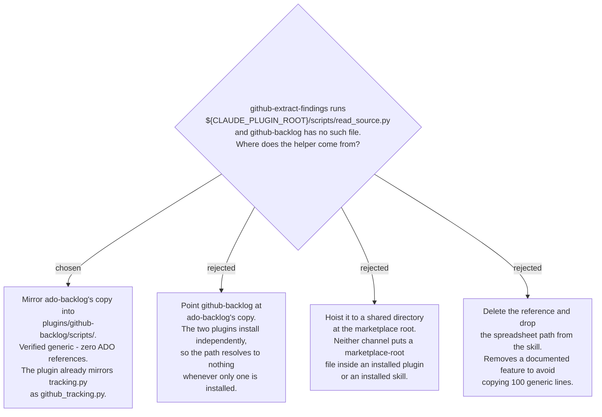

# `read_source.py` is mirrored into `github-backlog`, not shared across plugins

Task 3's reviewer swept all 55 skills for references that name a file their plugin does
not have, and found exactly one: `github-extract-findings/SKILL.md` lines 51 and 58 run
`${CLAUDE_PLUGIN_ROOT}/scripts/read_source.py`, and `plugins/github-backlog/scripts/`
holds only `create_github_issues.py`, `github_tracking.py` and `setup_check_github.ps1`.
This is not a defect the npx channel introduced — the skill was copied from
`ado-backlog`'s twin and the script never came with it, so the documented spreadsheet
input path has been broken for plugin-channel users the whole time. The generator simply
made it visible, because `resolve_files()` raises `MissingReference` on a named file that
does not exist and Task 5's build would have hard-failed on it.

Mirroring is the answer this repo has already given twice. `github-backlog`'s own
ADR 0001 chose two single-backend plugins over one multi-backend plugin, and accepted
the duplication that comes with that choice deliberately; `tracking.py` already lives in
both, once under each name. A shared copy would have to live somewhere both plugins can
reach at runtime, and there is no such place: `/plugin install` puts one plugin
directory on disk, and `npx skills add` puts one skill directory on disk. Anything above
either of those is not carried by either channel, which is the whole reason this branch
exists.

The file was checked before it was copied, not after: it names no Azure DevOps concept
and reads an Excel or CSV source into rows, which is why the same 100 lines serve both
backlogs. The cost is stated plainly — one generic helper that must now be changed in
two places, and `/copy-audit` is the tool that will say so when only one of them moves.
