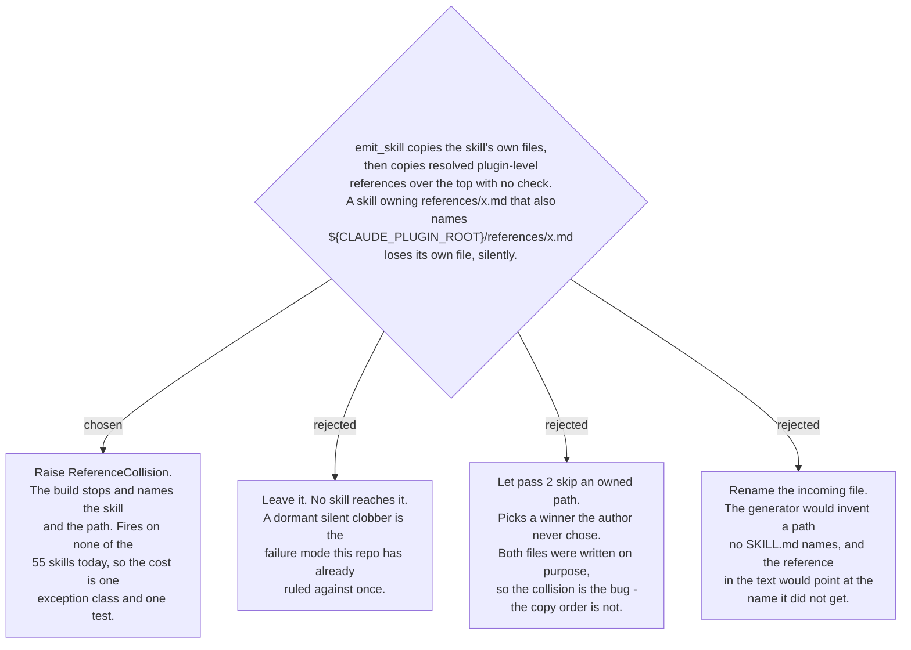

# A reference collision fails loudly rather than clobbering silently

`emit_skill()` writes a generated skill in two passes: everything in the source skill
directory, then every file the SKILL.md names, resolved against the plugin root and
placed at its plugin-relative path. The two passes share one destination namespace and
nothing checked whether they overlapped, so the second pass would overwrite the first
with no error and no output — a skill that shipped its own `references/x.md` and also
referenced the plugin's `references/x.md` would install with the plugin's copy, and the
only symptom would be a document that reads slightly wrong.

Nothing in the repo reaches it. The reviewer had to construct the collision to reproduce
it, and it fires on none of the 55 skills at either depth. Two things made it worth
fixing anyway. The code was a verbatim transcription of the controller's own brief, so
this is a plan defect rather than an implementer deviation, and a plan defect that
nobody's review caught is exactly the kind that survives into a rule someone later
relies on. And this repo has already settled the general question: ADR 0061 says a thing
that cannot be done must fail loudly rather than read as done. A silent overwrite is
that shape precisely — the build reports success, the tree looks complete, and the wrong
bytes are inside it.

Skipping the owned file instead of raising was the alternative worth taking seriously,
and it fails on authorship. If a skill carries `references/x.md` *and* its SKILL.md
names the plugin's `references/x.md`, someone wrote both on purpose and the generator
cannot know which one the reader is supposed to get. Choosing either silently makes the
generator the author of a decision it has no information for. Refusing to build hands
that decision back to the person who created the ambiguity, with the skill name and the
path in the message.
