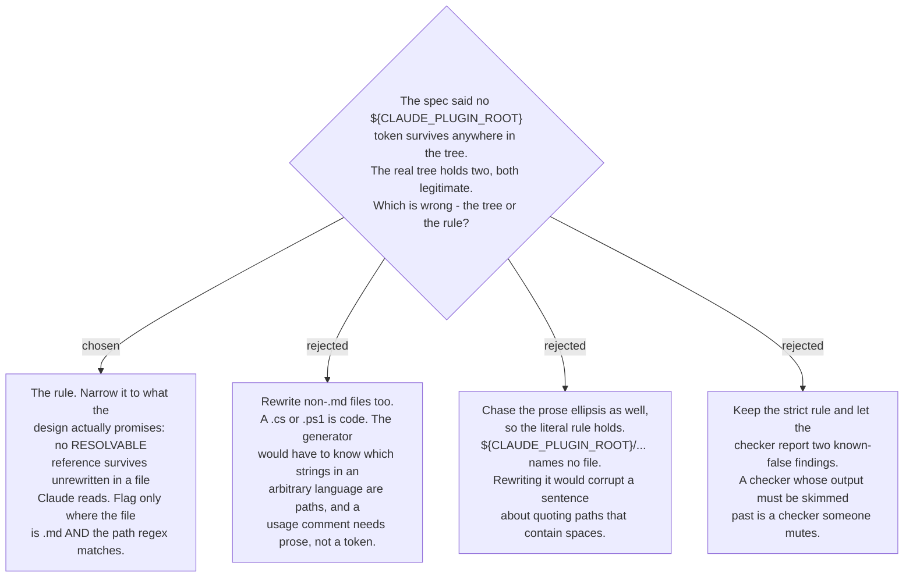

# The surviving-token invariant covers resolvable references in `.md` files

The design spec asserted that no `${CLAUDE_PLUGIN_ROOT}` token survives anywhere in the
generated tree. Built for real against all 55 skills, the tree violated that twice, and
both survivors are correct. `skills/my-work/scripts/my-work.cs` carries the token in a
usage comment, and only `.md` files are reference-rewritten — by design, because the
rewriter understands markdown links and shell invocations, not C#.
`skills/ado-create-work-items/SKILL.md` carries `"${CLAUDE_PLUGIN_ROOT}/..."` inside
prose about quoting a path that contains spaces, where the ellipsis is an ellipsis and
`REF_RE` deliberately refuses to read it as a path.

So the invariant is narrowed to what the generator actually promises: a reference that
*could* have been resolved and was not, in a file Claude reads. The checker flags a
`${CLAUDE_PLUGIN_ROOT}` occurrence only where the file is `.md` and the reference regex
matches a real path after it. That is a smaller claim than the spec made, and it is the
claim the code can honestly keep.

The narrowing was applied to the checker before Task 6 was dispatched, because a literal
implementation would have failed on the real tree from its first run. It amended the
published spec in place, in commit `c598fb9`, with no ADR to cite — this is the record
that amendment should have referenced.

The cost is named: an unrewritten reference inside a non-`.md` file is not caught by this
clause. That case is now demonstrated rather than hypothetical. `my-work.cs`'s comment
showed only the plugin-channel invocation, which reads wrong to anyone who installed
through npx, and the repair was to write both forms into the comment as prose — a
documentation fix, not a rewriting one. The token still survives there, still correctly.
