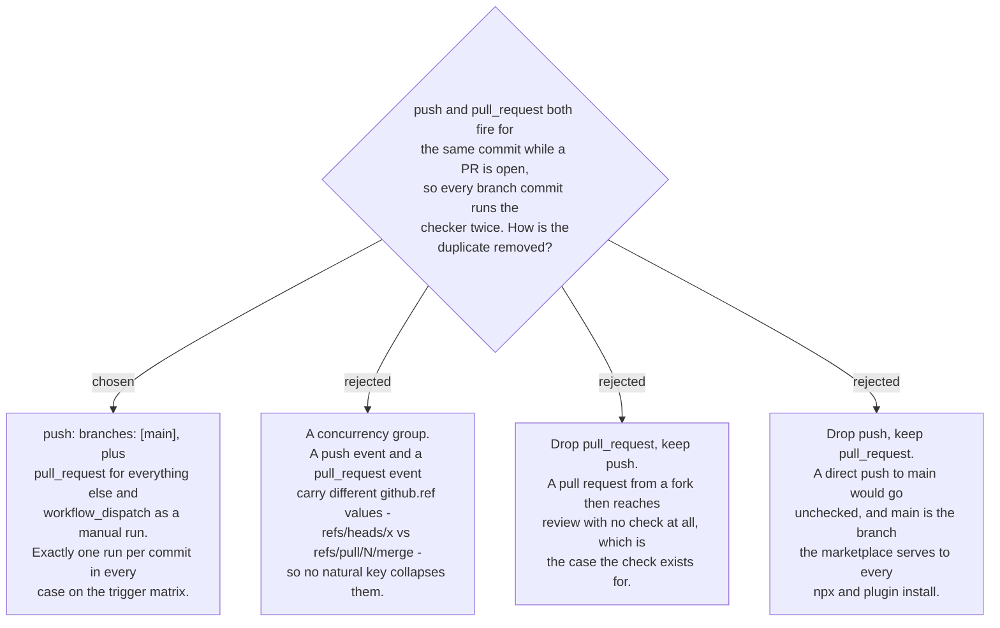

# The CI push trigger is scoped to `main`

`.github/workflows/skills-tree.yml` is this repo's first CI (ADR 0159) and exists to
prove the generated tree still matches its sources. The first draft — the controller's
own YAML — triggered on every push and every pull request, which means a commit pushed
to a branch with an open PR runs the same three commands twice, at the same time, on the
same content. That is not merely wasteful: two green checks on one commit teach a reader
to stop reading them.

A concurrency group is the reflex answer and does not work here. GitHub fills
`github.ref` from the event, so the push run sees `refs/heads/<branch>` and the
pull_request run sees `refs/pull/<n>/merge`. Any key built from the ref puts the two
runs in different groups and neither cancels the other, and a key built from something
coarser — the workflow name alone, say — would cancel unrelated branches' runs against
each other. Scoping the trigger removes the duplicate at its source instead of racing it
away afterwards.

The gap this leaves is worth stating rather than discovering: a direct push to a feature
branch with no pull request open gets no automatic check. The merge to `main` still runs
it, so nothing reaches the served branch unchecked, and `workflow_dispatch` gives anyone
a manual run on any branch from the Actions tab. Locally it is one command,
`python3 scripts/check_skills_tree.py --repo .`, which is what a person regenerating the
tree runs anyway.

The workflow has still never executed on GitHub. Pushing is a side effect outside the
worktree and belongs to the owner at branch-finishing time, so the three commands were
proven locally and CI itself remains unrun until that push happens.
