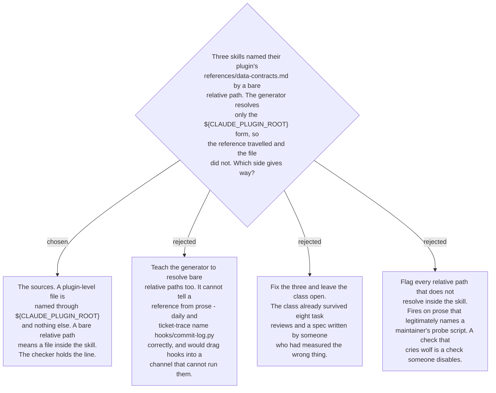

# A plugin-level file is named through `${CLAUDE_PLUGIN_ROOT}`, and the checker enforces it

The spec measured the problem by counting `${CLAUDE_PLUGIN_ROOT}` occurrences, so a
second class of reference went uncounted entirely: a plugin-level file named by a bare
relative path. Measured properly across all 55 skills, five skills name one, in two
classes that look identical in the text and are opposites in meaning.

Three are defects. `ado-auth`, `classify-work-items` and `classify-github-issues` each
point at `references/data-contracts.md`, their plugin's schema document, by bare path.
The generator never saw a reference there, so nothing was copied and nothing was
rewritten — and `classify-work-items` installed through npx as a lone `SKILL.md` whose
five mentions of that document all dangled, in the one skill whose entire job is
producing a file that matches those schemas. Two are correct. `daily` and `ticket-trace`
name `hooks/commit-log.py` and `hooks/hooks.json`, which are plugin-channel machinery
that deliberately never travels; resolving those into the tree would ship a hook the
channel cannot register, and `daily`'s prose was simply amended to say that the hook
depends on the plugin being enabled, the way `ticket-trace` already did.

So the rule is about the source text, not the generator: `${CLAUDE_PLUGIN_ROOT}/x` means
*bring this file with the skill*, a bare `x` means *a file the skill already has*, and
the two are never interchangeable. Teaching the generator to chase bare paths would
collapse that distinction — the same spelling would mean two things and the generator
would have to guess which, on prose, per occurrence.

Enforcement is what makes the rule real, and it is where the care went. The unimplemented
half of the spec's own §3 invariant is exactly the clause that would have caught this, so
it is now implemented: a bare relative path in a generated `.md` file is a finding when
it names a real file under that skill's own plugin root and no such file arrived in the
skill directory. All three conditions are load-bearing. Requiring the path shape keeps
ordinary English out; requiring the file to exist in the plugin means prose can only be
flagged by naming something the plugin actually has; and the arrival test is the defect
itself. Three exclusions come straight from the spec's own list of what the tree never
carries — `hooks/`, `commands/`, and the test files and fixtures `is_excluded()` drops —
which is what separates `daily`'s correct sentence from `classify-work-items`' broken
one. Scoping to `.md` targets keeps it to the read half of ADR 0164, whose run half
already has its clause over `${CLAUDE_SKILL_DIR}`.

Run against the tree as it stood, the check reported those three and nothing else.
