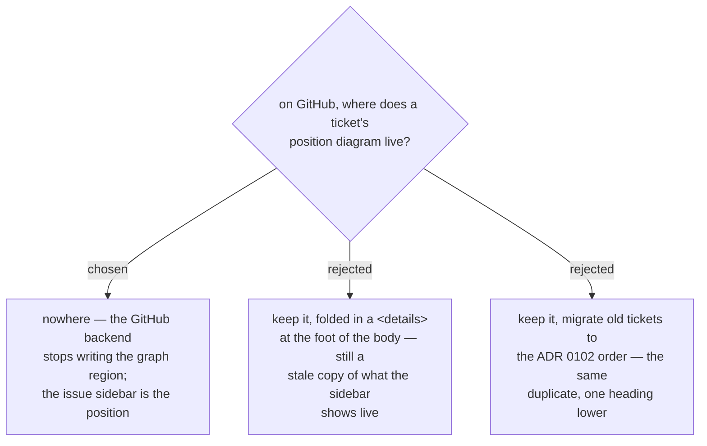

# The GitHub backend does not write the position diagram

On GitHub the position diagram duplicates what the tracker already renders. The
GitHub backend writes real sub-issues and real blocked-by dependencies (ADR 0062),
so every ticket issue's sidebar shows its parent map, its blockers and what it
blocks — and that view is live, striking a blocker through the moment it closes.
The diagram is deliberately structure-only (ADR 0064), so on GitHub it is a
second, staler rendering of the same three-level neighbourhood, and on a fresh
ticket it is a single-box picture of the ticket itself. The owner's report was that
the tickets are hard to read; the diagram was the thing being read past.

So the GitHub backend writes no `decision-map:graph` region: not on create, not on
the edge-wiring pass of `chart`, and not in `block`. The **local backend is
unchanged** — a markdown file in a repo has no sidebar, so there the diagram is the
only rendering of the ticket's position and it keeps its place below `## Question`
(ADR 0102). This is the first region the two backends do not share; ADR 0062's
"byte-identical regions" now reads *every region both backends write*, and the
contract names the exception.

ADR 0063 and ADR 0064 stay in force for the local backend. ADR 0102 stays in force
for the local backend and, for the GitHub backend, is superseded by this one: its
"where does the diagram sit" question has no answer on GitHub because nothing sits
there. Moving the diagram (option C) or hiding it (option B) were both rejected for
the same reason — each keeps writing a copy of the sidebar, and a copy that ADR 0064
forbids from carrying status will always be the less true of the two.
