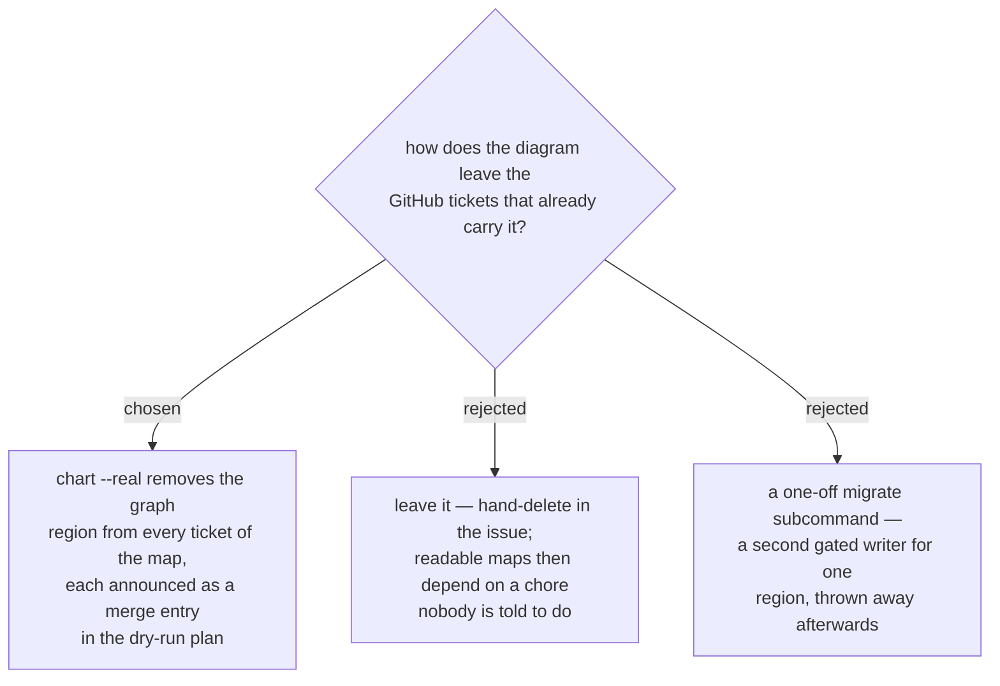

# A GitHub `chart` re-run strips the position diagrams it once wrote

ADR 0171 stops the GitHub backend writing the position diagram, but the tickets of
every map charted before it still carry one, and `assert_regions` refuses any
decision-map marker outside a declared region — so an undeclared graph region would
make every old ticket unwritable at its next `resolve`. Two things follow.

**The region stays declared but is never rendered.** `TRACKER_TICKET_REGIONS` keeps
the graph pair so an old ticket that has not yet been through `chart` still passes
the marker invariant on `resolve`, `claim` and `block`; those subcommands leave the
region exactly where they found it, as they leave everything they did not write.

**`chart` is the one writer that removes it.** On the GitHub backend, `chart`'s
edge-wiring pass — the pass that used to re-render the diagram at both ends of every
edge — now strips the graph region from every ticket of the map that holds one, and
`chart_plan` announces each as a `merge` entry with a non-null detail, so the ADR
0039 gate shows the removal before the user approves the real run. Removing a
region the tool itself generated is not the overwrite ADR 0058 forbids: nothing a
person recorded is touched, and the byte-identical no-op guarantee holds again from
the second run onward. The first `chart` after the upgrade is deliberately *not* a
no-op, and the plan says so ticket by ticket.

A `migrate` subcommand was rejected as a second gated writer for one region, used
once and then dead code. Leaving the region for hand deletion was rejected because
the map the owner reported as hard to read would stay that way unless someone
remembered a chore no skill prompts.
