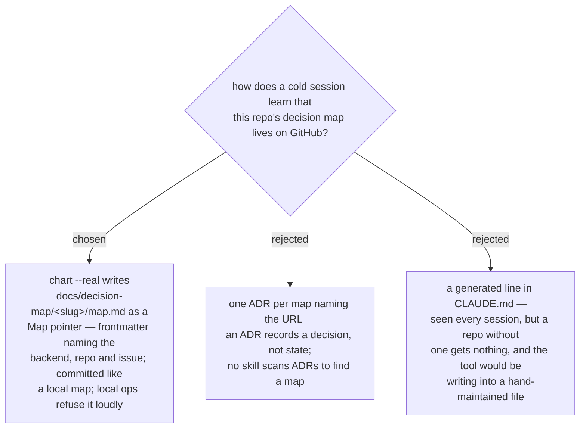

# A GitHub map leaves a pointer file in the repo

On the GitHub backend `chart` wrote nothing into the repo, and `work-map`'s
preflight learned that a map lives on GitHub only when the user said so. A session
opened cold in that repo looked at an empty `docs/decision-map/`, concluded there
was no map, and pointed at `/decision-map:chart` — while eleven tickets waited on
the tracker. That is an absence read as a fact, the shape ADR 0061 forbids.

So a GitHub `chart --real` also writes a **Map pointer**: `docs/decision-map/<slug>/map.md`
with YAML frontmatter (`type: decision-map-pointer`, `backend: github`, `repo`,
`issue`, `url`) and one paragraph saying where the map is and which command works
it. `docs/decision-map/` is therefore the one place every map is listed, whichever
backend holds it — the sentence the playbook already used. The pointer is a repo doc
on the ADR 0042 side of the boundary: `chart` announces it in the dry-run plan as a
`create`, writes it on `--real`, and the skill offers the commit exactly as it does
for a local map, so "on GitHub there is nothing to commit" stops being true. A
re-run of `chart` on a map charted before this ADR creates the pointer it never had,
the same gated run that strips the position diagrams (ADR 0172).

Three consequences the pointer forces. **`work-map` reads it**: the preflight takes
`--repo` and the map's issue number from the file instead of asking — this is not
inferring the repo from the git remote, which the skill still forbids, because the
pointer was written by a deliberate `chart` the user approved. **The local backend
refuses it**: every local subcommand that opens `map.md` checks for the pointer
frontmatter first and exits `2` naming the GitHub command to run, so a pointer can
never be read as an empty local map with no tickets. **The pointer carries no
state**: no status, no frontier, no ticket list — those stay on the tracker, and
the pointer is not refreshed by anything but `chart`, so it cannot go stale in a
way that misleads (it names where the map is, not what the map says).
