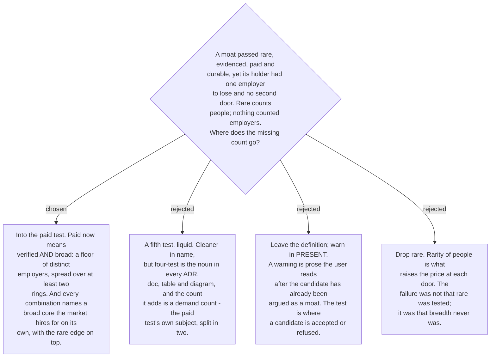

# The `paid` test requires breadth of demand, and a moat sits on a common core

ADR 0044 defines a moat as a combination that passes four tests, and its `paid`
test asks only that demand be verified by real market signals. Station 2 measures
that as posting counts per ring. So a combination held by few people, with real
postings behind it, passes `rare` and `paid` even when every posting comes from
three employers in one country. The person who holds it has a defensible price and
no second door: when the one employer loses its customers, the moat does nothing.
That is exactly the position the skill was built to prevent, and on 2026-09-05 the
user named it from experience. `rare` counts people who can supply the combination;
nothing in the definition counts the employers who buy it. The two are different
axes, and a moat is strong only in the corner where supply is thin and demand is
wide.

So the `paid` test now has two halves, and a candidate must pass both. **Verified**
is unchanged: demand claims carry sources and confidence grades, and a `Directional`
claim can never be the sole basis. **Broad** is new: the demand behind the
combination must come from a stated floor of **distinct employers**, spread across
**at least two of the three rings** (Thailand, SEA, global remote), not concentrated
in one employer, one client type or one country. Station 2's demand table therefore
records the distinct-employer count next to the posting count for every skill area,
and Station 3's `paid` line states both numbers and the ring spread. The floor is a
number the skill states in each run and defends in `market-report.md`, because the
right value differs by ring and by how the boards deduplicate; it is not fixed here.

The second rule follows from the same failure. A combination is now shaped as a
**broad core plus a rare edge**. The core is a skill area the market hires for on
its own, at scale, in the rings surveyed; the edge is what makes the combination
rare. Station 3 names which component is the core in every candidate, and a
candidate whose every component is niche fails `paid` on breadth. The core keeps the
person employable when any single employer falls; the edge raises the price at each
door. Rarity is an add-on to employability, never a replacement for it. ADR 0044
already required combinations rather than single skills; this ADR says what shape
the combination must take.

Three things do not change. The count of tests stays four, so every document that
says four-test stays right. `durable` still means survival against AI absorption
over three years and is not made to carry liquidity. And no moat is claimed to
prevent a company from running out of customers: that is company risk, and what a
moat changes is what happens the day after, how many doors open and at what price.

Supersedes [ADR 0044](0044-moat-is-four-test-intersection.md) in part: the `paid`
test's wording. The spec and plan of 2026-07-31 carry a banner pointing here.
