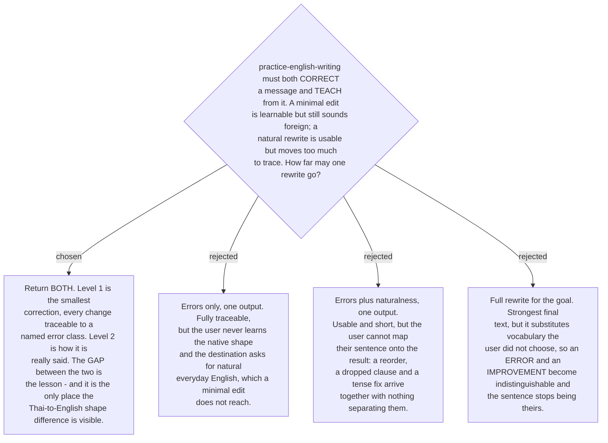

# The rewrite returns two levels — a minimal fix and a natural version

The skill has two jobs that pull in opposite directions. Correcting wants the smallest
possible edit, because a change the user cannot trace teaches nothing. Producing usable
English wants a free hand, because natural English often restructures the sentence
entirely — Thai keeps the frame *I want to know that…*, English drops it and simply asks
the question. A single output has to pick one job and fail the other.

So the rewrite returns **two levels**, always both:

- **The minimal fix.** Only what was wrong. Every change is attributable to one error
  class from the taxonomy resolved on ticket #16, and is shown that way. The user's
  sentence, its frame, its vocabulary and its length survive.
- **The natural version.** How a fluent writer would actually put it, in the register
  the message calls for.

The gap between the two is not a byproduct — it is the pedagogical content. The minimal
fix teaches the rule that was broken; the distance to the natural version teaches the
L1 shape difference that no error label can name, because it is not an error at all.
A learner shown only the natural version sees a sentence they cannot derive; a learner
shown only the minimal fix concludes their English is now correct, which it is, and
also that it is now good, which it is not.

The cost is real and accepted: two outputs to read on every use. Ticket #18
(`output-card`) decides how they are laid out so that cost stays small; this ADR fixes
only that both exist and that level 1 is attributable per error class.

This binds ticket #18: a card design that shows one level, or that renders the minimal
fix without its error labels, contradicts this decision. It also binds `build-fixer`
(#22).
