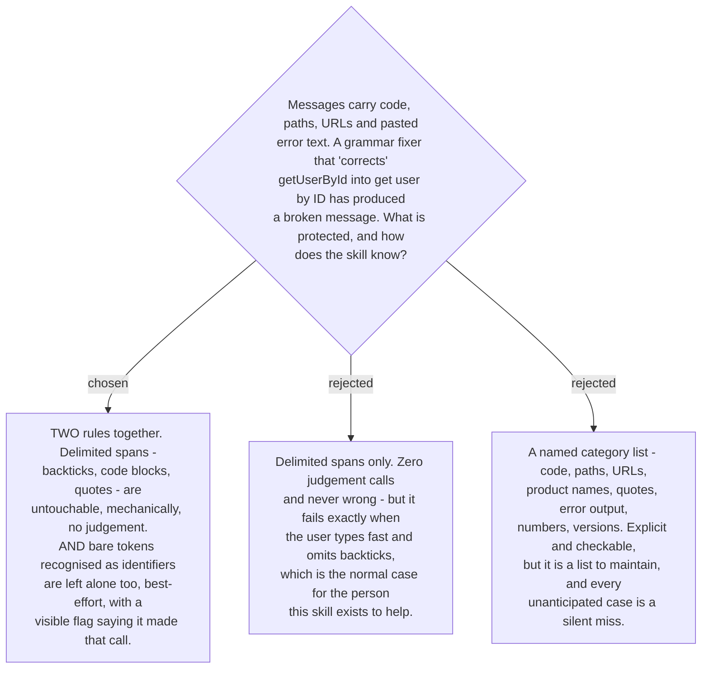

# Protected spans — delimiters absolutely, bare identifiers best-effort with a flag

The mechanical rule is the floor and it is absolute: anything the user delimited —
backtick spans, fenced blocks, quoted strings — is copied through byte for byte. It
needs no judgement and it is never wrong.

The floor is not enough. The user reaches for this skill *because* writing English is
effort, and someone typing under that effort does not stop to add backticks around
`getUserById`. A skill that only honours delimiters would break identifiers precisely
in the messages that need it most. So a second rule sits on top: a bare token that
looks like an identifier — camelCase, snake_case, a dotted path, a file extension, a
flag, a version string, a number — is left alone as well.

That second rule is a judgement, so it is **best-effort and it must say so**. When the
skill protects a bare token it flags it: *I left `getUserById` alone — it looks like an
identifier. Tell me if it is not.* The flag is what makes an unreliable rule safe to
ship: a wrong guess costs one line of correction instead of a silently mangled message.
The asymmetry is deliberate — over-protecting leaves a word unfixed, under-protecting
corrupts a name, and only one of those is recoverable by reading the output.

The rejected category list is not wrong, only weaker: it is the same coverage expressed
as an enumeration rather than as two principles, so it grows a maintenance burden and
still misses whatever nobody listed.

This binds `build-fixer` (#22). It also constrains #18: the card must have somewhere to
put the protection flag.
