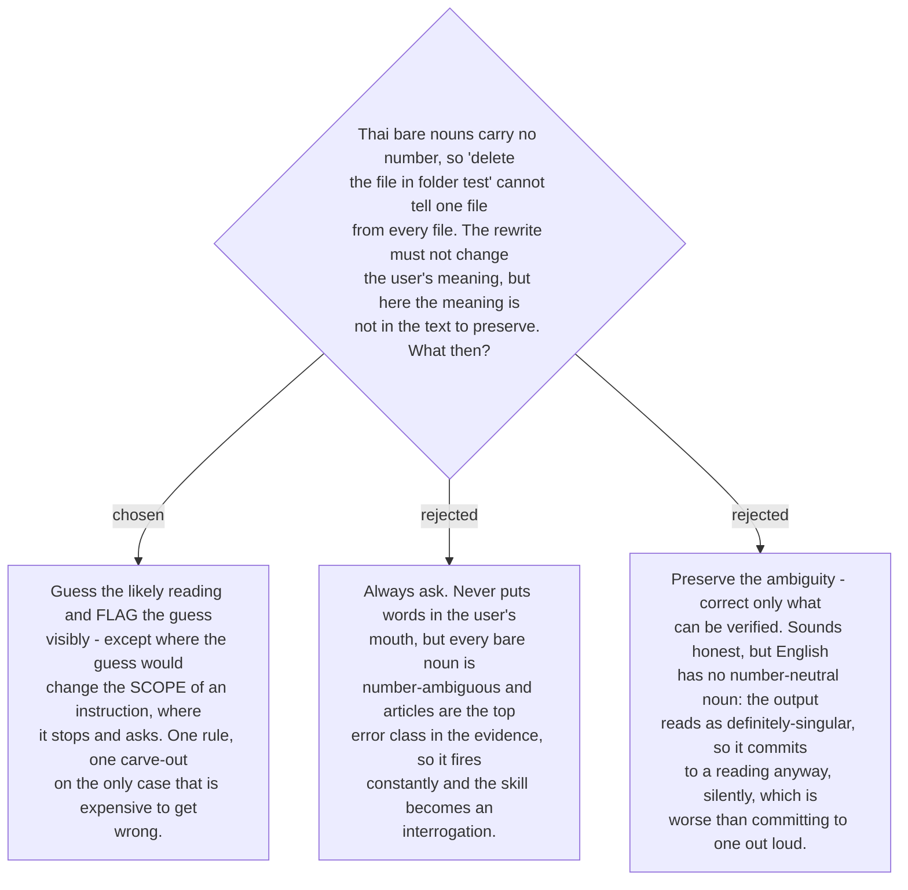

# An unrecoverable meaning is guessed and flagged — unless the guess changes scope

The research on ticket #16 established the mechanism: a Thai bare noun is unmarked for
number and for definiteness, and plurality is carried by a numeral-plus-classifier or a
quantifier that English does not require. When the user writes *the file*, the number is
not merely unstated — it was never encoded. There is nothing to preserve.

English offers no neutral form to fall back on, which is what disqualifies the
preserve-the-ambiguity option. Emitting *the file* is not a refusal to decide; it is a
decision to say singular, made silently. Between deciding silently and deciding out
loud, out loud wins.

Asking every time is correct and unusable. Articles and noun number are the two highest
frequency error classes in every study surveyed, so the ambiguity is not an edge case —
it is most sentences. A skill that halts on each one costs more attention than writing
the English by hand, which is the failure mode it exists to remove.

So: **guess the most probable reading, and mark the guess** where the user can see it,
so correcting it costs one word. **Except** when the guess would change the scope of an
instruction — how many things get deleted, which records get touched, whether an action
applies once or repeatedly. There the cheap-to-correct assumption stops holding, because
the message may be acted on before the flag is read, so the skill asks instead.

The carve-out is scoped to instruction scope specifically, not to some general notion of
risk: risk is unbounded and would collapse this back into always-ask.

This binds `build-fixer` (#22) and constrains #18, which must render a guess flag
distinctly from an error label — they are different claims. A guess says *I decided
something you did not say*; an error label says *you got this wrong*. Presenting them
alike would teach the user that their unmarked plural was a mistake, which
[ADR 0178](workflow-daily-work-0178-the-target-register-is-detected-per-message-not-fixed.md)
guards against in a different form.
