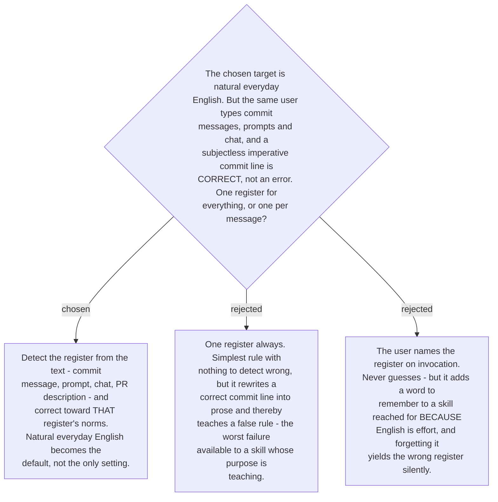

# The target register is detected per message, not fixed

The register was chosen at chart time as natural everyday English, and this ADR does not
change that: it makes it the default rather than the whole rule.

The reason is a specific finding from ticket #16. Among the Thai-L1 error classes, the
research flagged `subject-drop` as **confounded in this user's register**: *Fix login
bug* has no subject and no article, and in a commit message that is not an error, it is
the convention. A one-register skill would correct it to *I fixed the login bug* and, in
the same breath, report a `subject-drop` error that did not occur. For a fixer that
would be a bad output; for a teacher it is the worst available failure, because the user
takes the correction as the rule and learns something false. The same research
established that a fixed frequency ranking is an artifact of genre rather than a
property of the writer — register-blindness is that error in a second form.

So the skill infers what kind of text it has been given and corrects toward that
register's norms: imperative and terse for a commit subject, direct and unambiguous for
a prompt, natural and contracted for a message to a person, structured for a PR
description. Where it cannot tell, natural everyday English is the fallback, which is
why the chart-time choice still stands as the default.

Detection can be wrong, and the mitigation is the one already established in
[ADR 0176](workflow-daily-work-0176-protected-spans-are-delimiters-absolutely-and-identifiers-best-effort.md):
name the call. The skill states the register it detected, so a wrong read costs one
line to correct rather than a wrong lesson to unlearn. Asking the user to declare it up
front was rejected for the reason the skill exists at all — it charges effort to the
person who is short of it.

This binds `build-fixer` (#22), and it feeds `memory-schema` (#19): a recorded mistake
without its register is not re-usable evidence, because the same token can be an error
in one register and correct in another.
