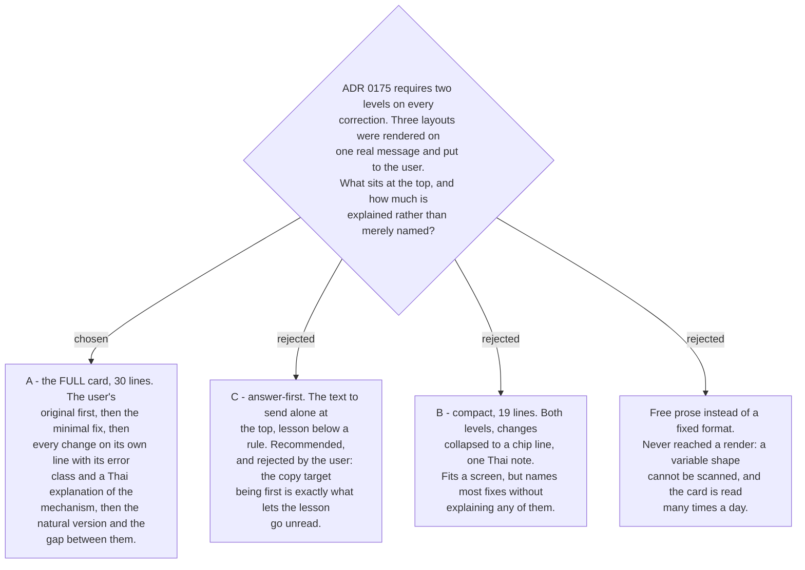

# The correction card is lesson-first and explains every change

Three candidate layouts were built as a rendered prototype and shown on the same real
input — broken English carrying a Thai politeness particle, a backticked path and a line
number. The prototype is the record of the decision:
<https://claude.ai/code/artifact/dc60db95-5f51-4940-b4e8-47a2d18bac2a>

The user chose **A**, against the recommendation. That is the substance of this ADR, and
the reason matters more than the layout: the recommendation optimised for speed of use,
and the user is not here for speed. A card whose first line is the text to copy will be
copied and not read, and the skill would degrade into a translator. Putting the original
first and the natural version last forces the eye through the lesson on the way to the
answer. The 30-line cost is accepted deliberately.

So the card is a **fixed format**, in this order: the register it detected · the user's
original · the minimal fix with every changed token highlighted · every change on its own
line with its error class and a Thai explanation of the mechanism · the guess flags and
protected spans · the natural version · the gap between the two levels, in Thai.

Two rendering rules came out of the user's own review of the first draft, and both are
binding:

- **Every changed token is highlighted.** The first draft highlighted only the changes it
  had labels for, which silently hid the rest.
- **A capitalisation change is underlined as well as highlighted**, because unlike
  `return` → `returns` the word looks unchanged at a glance. That review is also what
  produced [ADR 0180](workflow-daily-work-0180-capitalisation-is-the-ninth-error-class.md).

The guess flag stays a colour plus a glyph rather than its own block; the user confirmed
it reads distinctly from an error label, which is what
[ADR 0177](workflow-daily-work-0177-unrecoverable-meaning-is-guessed-and-flagged-unless-the-guess-changes-scope.md)
requires. One Thai explanation per class is the confirmed level of detail.

This makes ticket #24 (`long-input-behaviour`) sharper rather than easier: 30 lines for one
sentence is the best case, and the card has no answer yet for a paragraph.
