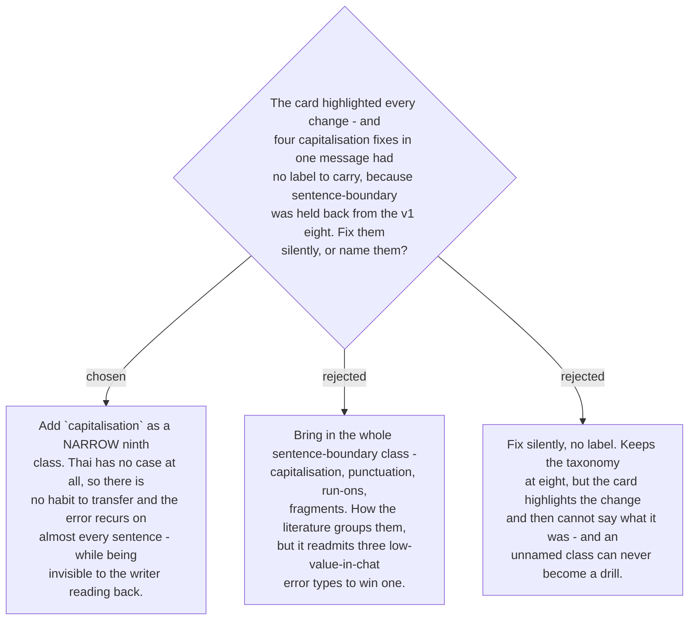

# Capitalisation is the ninth error class

Ticket #16's research recommended eight classes and held `sentence-boundary` back, judging
it "frequent but low-cost in chat". Capitalisation sits inside that bundle, so it was cut
with it.

The cut did not survive its first contact with a rendered card. Shown a real message, the
user asked for the changed text to be highlighted "e.g. lowercase to uppercase" — naming
precisely the class that had been removed. One message contained four such changes
(`i → I`, `the → The`, `and → And`, `i → I`) and the card could highlight none of them,
because it had no label to attach.

The mechanism is strong and specific: **Thai has no upper and lower case whatsoever.**
There is no capitalisation habit to transfer, correctly or incorrectly, so the error is
not a slip — it is the absence of a rule. It therefore recurs at near-constant rate, and
it is close to invisible to the writer proof-reading their own text, which is exactly the
profile of an error worth automating.

`capitalisation` is added as its own narrow class rather than by readmitting the whole
bundle. Run-ons, fragments and punctuation keep the reasoning that held them back; only
the one class with a demonstrated, mechanism-backed, user-confirmed need comes in. The
label set is now **nine**: `article`, `sv-agreement`, `preposition`, `plural`,
`word-choice`, `verb-tense`, `copula`, `existential`, `capitalisation` — with `other`
still reserved and the set still open.

This is the first exercise of a rule #16 wrote for itself: **observed frequency overrides
the published ranking**, because every study sampled a register nobody writes prompts in.
It fired on the first real look at real output, which is evidence that the mechanism
works and that eight was never meant to be final. The slug is frozen from here, since it
keys the mistake memory.

Amends the resolution of ticket #16, which recorded eight classes; that ticket carries a
comment pointing here. Its recommendation to drop `register` and to keep the set open is
unchanged. Binds `memory-schema` (#19), whose per-class counts now cover nine, and
`build-fixer` (#22).
