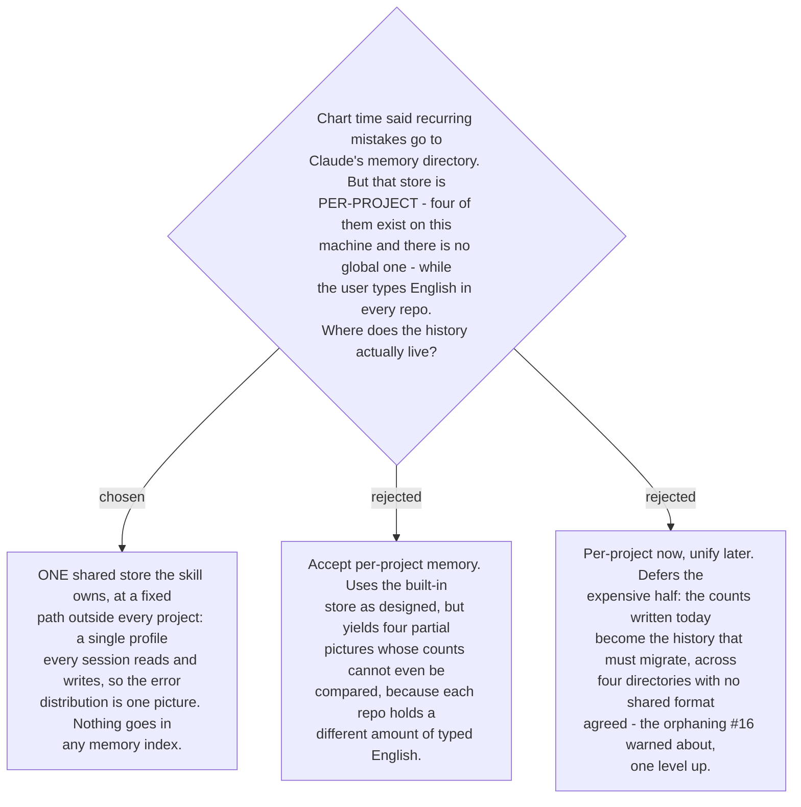

# The mistake profile is one shared store, outside the per-project memory directories

The chart-time decision said mistakes are remembered in "Claude's auto-memory directory,
not in repo files". Checking the machine before designing anything showed the second half
holds and the first half does not do what was intended: memory is **project-scoped**.
Four directories exist under `~/.claude/projects/*/memory` and there is no
`~/.claude/memory`.

That scoping is fatal to the purpose. The user writes English in every repo they open, so
a per-project store would accumulate four partial histories. Ticket #16 established that
the whole taxonomy rests on **observed frequency overriding the published ranking**, since
no study has sampled this register — and a frequency split four ways measures nothing.
Worse, the counts would not be comparable across the four, because each repo holds a
different volume of typed English. Drill mode (#20) would then quiz the user on whichever
repo happened to be open.

So the profile lives in **one store the skill owns**, at a fixed path outside every
project — `~/.claude/practice-english-writing/`. It is grouped with Claude state because
that is what it is, and it sits beside the per-project directories rather than inside any
of them.

Two consequences follow, and both are improvements:

- **Nothing is written to any `MEMORY.md`.** The index is loaded into context at the start
  of every session in its project, so a row per error class would tax every unrelated
  coding session. The store's path is a constant in `SKILL.md`, so no pointer memory is
  needed to find it. An earlier draft of this decision proposed one; on writing it up it
  bought nothing and cost context, and was dropped.
- **The one-fact-per-file rule stops applying.** That rule governs the memory directory,
  and the profile is no longer in it — which is what makes
  [ADR 0182](workflow-daily-work-0182-the-profile-holds-counts-and-a-capped-sample-not-a-log.md)'s
  aggregate shape possible at all.

The chart-time note recorded on the map is superseded in its mechanism and upheld in its
intent: still not repo files, still remembered across sessions, but one store rather than
one per project.
