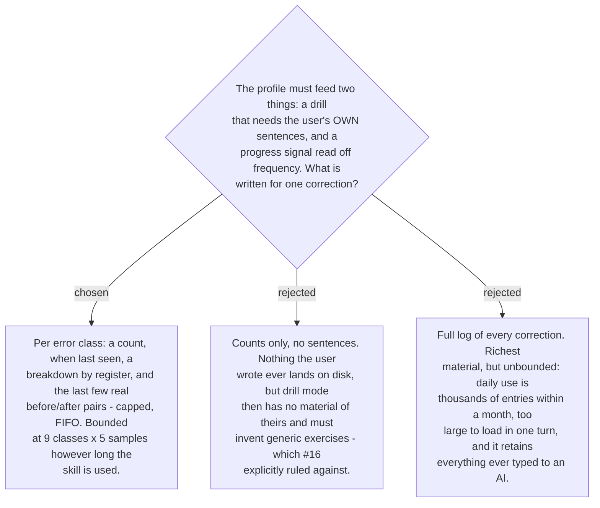

# The profile holds counts and a capped sample, not a log

The profile serves two consumers with opposite needs. `progress-signal` (#21) wants
frequency — how often a class fires, and whether that is falling. `drill-design` (#20)
wants material, and #16 was explicit that drill items must be drawn from recorded mistakes
rather than invented. Counts alone starve the second; a full log satisfies both and then
grows without limit.

So each of the nine error classes carries a **count**, a **last-seen date**, a
**breakdown by register**, and a **capped, FIFO sample** of real before/after pairs. The
register breakdown is required by
[ADR 0178](workflow-daily-work-0178-the-target-register-is-detected-per-message-not-fixed.md):
the same token is an error in one register and correct in another, so a count that does
not say which register it came from is not re-usable evidence.

The cap is what makes the shape hold. Nine classes times a handful of samples is the
ceiling however long the skill is used, so the file stays small enough for a session to
load whole — which is also the answer to the ticket's question about reading the history
back without loading all of it. There is nothing to page through.

**Retention is a real cost and is stated rather than hidden.** Storing samples means the
user's own sentences land on disk, and those sentences may carry work content. The cap
bounds how much, the store is local and outside every repo, and the user can delete
samples by hand — which is one of the reasons
[ADR 0183](workflow-daily-work-0183-the-profile-is-markdown-because-its-reader-is-a-model.md)
makes the file editable.

The profile also carries a **label-set version**, as #16 required, so that a future rename
of a class slug can migrate the recorded history instead of orphaning it. The set is nine
as of [ADR 0180](workflow-daily-work-0180-capitalisation-is-the-ninth-error-class.md).
