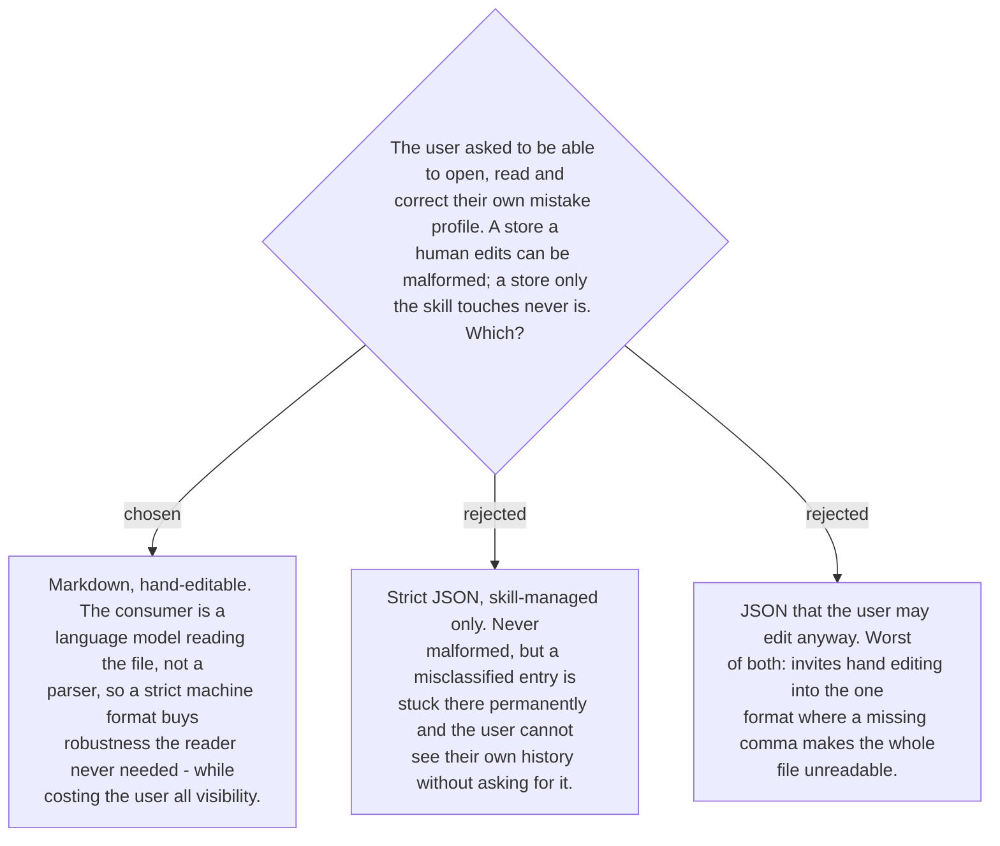

# The profile is Markdown, because its reader is a model

The user asked to be able to open the store, see their own counts, fix a misclassified
entry and delete a sample they would rather not keep. That settles editability; the
question left is which format survives it.

The decisive fact is who reads the file. **The consumer is a language model loading the
profile as text, not a parser.** A strict machine format exists to protect a parser from
malformed input, and there is no parser here — so JSON's robustness is bought for a reader
that never needed it, and paid for in the user's ability to see and correct their own
history. Markdown reads cleanly to the model, edits cleanly by hand, tolerates a stray
line, and matches every other document in this repo.

Practical consequences the implementation must honour:

- **The skill rewrites the file rather than appending to it**, so hand edits are absorbed
  on the next write rather than duplicated.
- **A malformed or partially edited profile degrades, it does not fail.** A class the skill
  cannot read is treated as absent — count zero — never as a reason to refuse the
  correction the user actually asked for. The fixer must work with no profile at all,
  since on first run there is none.
- **The user's edits are authoritative.** If they delete a sample or correct a class, the
  skill does not restore it from anywhere; there is nowhere else it is written.

This is the same reasoning that makes the store legible in the first place: a profile the
user cannot inspect cannot be trusted to be a fair record of their own mistakes, and the
skill's whole claim on their attention is that the record is fair.
