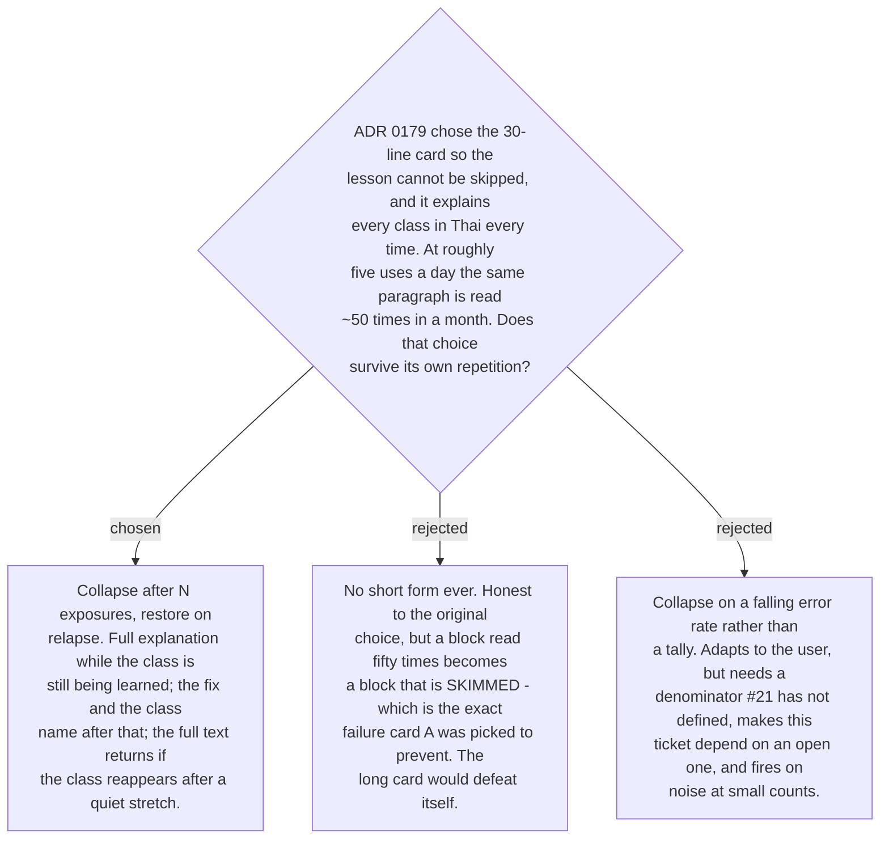

# A class explanation collapses after N exposures and returns on relapse

The card chosen in
[ADR 0179](workflow-daily-work-0179-the-correction-card-is-lesson-first-and-explains-every-change.md)
puts the full Thai mechanism explanation for every error class on every card. That is
right while a rule is being learned and wrong once it has been. The failure mode is not
boredom: a reader who has seen the same four lines fifty times stops reading them, and a
skimmed card is precisely what the lesson-first layout exists to prevent. Keeping the
explanation forever would defeat the decision it was meant to honour.

So a class's explanation has two states:

- **Full**, for its first N exposures — the fix, its class label, and the Thai mechanism.
- **Short**, after that — the fix and the class label only. Roughly eight lines come off
  a typical card.

**Relapse restores the full form.** If a class falls silent and then fires again after a
quiet stretch, the explanation comes back with a note saying how long it had been gone.
The evidence for this is the same evidence that justified collapsing: an error returning
after a gap is the signal that the rule did not hold, which is exactly when the
explanation is worth its lines again.

The trigger for both is already in the store — the profile records a per-class exposure
tally and a `lastSeen` date
([ADR 0182](workflow-daily-work-0182-the-profile-holds-counts-and-a-capped-sample-not-a-log.md))
— so no new signal is invented, only counted differently
([ADR 0185](workflow-daily-work-0185-the-collapse-trigger-counts-distinct-days-not-occurrences.md)).

**N and the relapse gap are stated values, not derived ones.** The initial pair is ten
exposure-days and a fourteen-day gap, and neither rests on evidence — no study has
measured this for this user in this register, the same gap #16 recorded for the frequency
ranking. They are written where they can be read and changed, and the skill states which
values it used, so a wrong guess is visible and cheap to correct rather than baked in.
