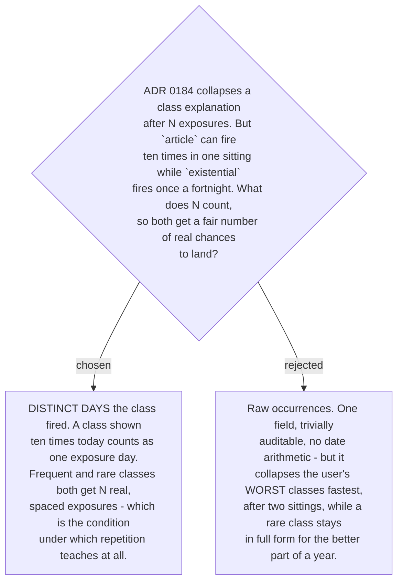

# The collapse trigger counts distinct days, not occurrences

A raw tally makes the trigger a function of how often a class fires rather than how many
times the user has actually engaged with its explanation. That inverts the intent twice
over. The top class, `article`, would reach twenty occurrences inside two sittings and
collapse before a single night's sleep had passed — while `existential`, firing once a
fortnight, would still be printing its full explanation nine months later.

Counting **distinct days** fixes both ends with one rule. Ten exposure-days is ten
separate occasions on which the user read the explanation with time in between, whether
the class fires once on each of those days or ten times. Spacing is the thing that makes
repetition teach, so spacing is what the trigger should count.

This **extends the profile schema in ADR 0182**, which recorded a `count` and a
`lastSeen` but nothing that distinguishes ten occurrences on one day from ten across ten
days. Each class therefore also carries the number of **distinct days it has fired**,
incremented at most once per calendar day. That amendment is noted on 0182 and on the
resolution of ticket #19, which described the earlier shape.

The raw `count` stays. It is still what
`progress-signal` (#21) will read, and it is still what the frequency-overrides-the-
literature rule from #16 depends on; the day tally answers a different question and does
not replace it.
