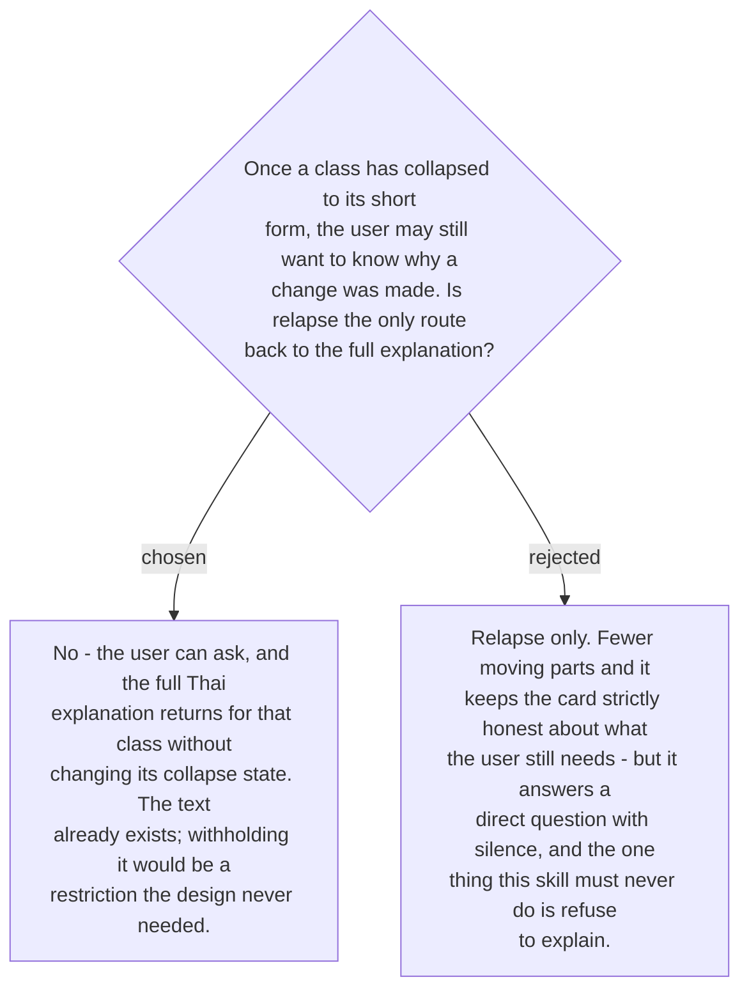

# A collapsed explanation expands on demand

Collapsing an explanation is a judgement about what the user needs *by default*. It should
never become a judgement about what they are allowed to see. A skill whose purpose is
teaching cannot answer "why did that change?" with "you have seen this ten times already".

So asking expands: the full mechanism text for that class comes back for the message at
hand. The cost is near zero, because the canonical Thai sentence for every class already
has to exist — ticket #25 makes it a maintained asset — so expanding is retrieval, not
generation.

**Asking does not reset the collapse state.** Curiosity is not relapse. Only making the
mistake again after a quiet stretch restores the full form by default
([ADR 0184](workflow-daily-work-0184-a-class-explanation-collapses-after-n-and-returns-on-relapse.md)),
and keeping those two paths separate is what stops a user who reads carefully from being
punished with a permanently longer card.
