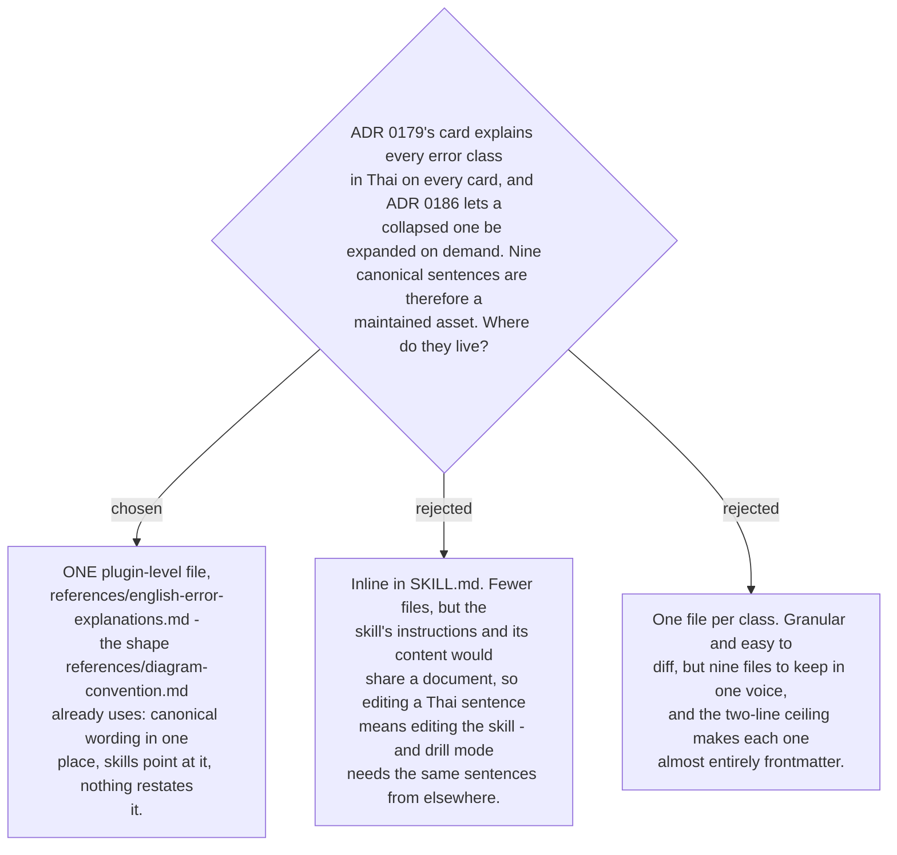

# The nine explanations live in one plugin-level reference file

The Thai explanations stopped being incidental prose the moment
[ADR 0179](workflow-daily-work-0179-the-correction-card-is-lesson-first-and-explains-every-change.md)
put one on every card and
[ADR 0186](workflow-daily-work-0186-a-collapsed-explanation-expands-on-demand.md) made
them retrievable on demand. Nine sentences that must be accurate about Thai, consistent
with each other in voice, and stable enough that a user reads the same wording on the
first exposure and the fiftieth is an asset, and assets need one owner.

This repo already has the pattern. `references/diagram-convention.md` opens with
*"Canonical wording … Skills point here; nothing else restates these rules. To change the
convention, change THIS file only."* The explanations file carries the same clause, and
is placed beside it at plugin level rather than inside the skill's own directory —
because more than the fixer reads it. Drill mode (#20) needs the same sentences, and a
file owned by one skill that another skill reaches into is the arrangement this repo's
own conventions warn against.

Consistency with those conventions is not incidental here: `${CLAUDE_PLUGIN_ROOT}/references/…`
is one of the three path shapes the Antigravity installer rewrites, so a reference in this
location works in both harnesses without touching `install-antigravity.py`.

The file also carries `other` explicitly, with **no** canonical explanation — a correction
filed under `other` takes a free-text note instead, and those notes are the evidence for
what a tenth class should be. That keeps the open-set rule from #16 visible in the same
place the closed nine are written down.
