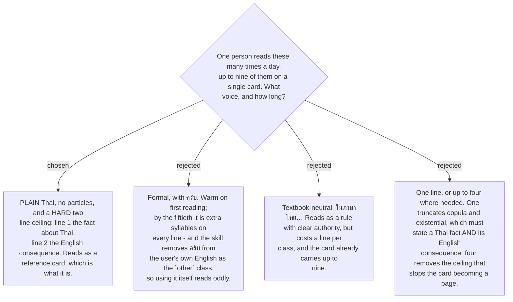

# Explanations are plain Thai with a two-line ceiling

The audience is one person, reading the same sentences daily. That rules the register more
than any style preference does. Politeness particles are warmth on a first reading and
noise on a fiftieth, and there is a specific awkwardness here besides: the skill deletes
`ครับ` from the user's own English and files it under the `other` class, so a card that
then uses `ครับ` at the user is teaching one thing and doing another.

The two-line shape is a ceiling and also a template. Line 1 states the fact about Thai;
line 2 states what English does instead. Every class fits that frame, which is why the
nine read as one voice rather than nine authors — and the frame is what makes them
comparable when several appear on the same card. One line was rejected because `copula`
and `existential` genuinely need both halves; four was rejected because the ceiling is the
only thing standing between a nine-class card and a page.

The ceiling is enforced on the content, not on the caveat. A `Caveat` line is prose, sits
outside the two lines, and is shown only on request
([ADR 0189](workflow-daily-work-0189-explanations-are-teachable-first-with-the-precise-version-kept.md)),
so precision never costs the daily reader a line.
