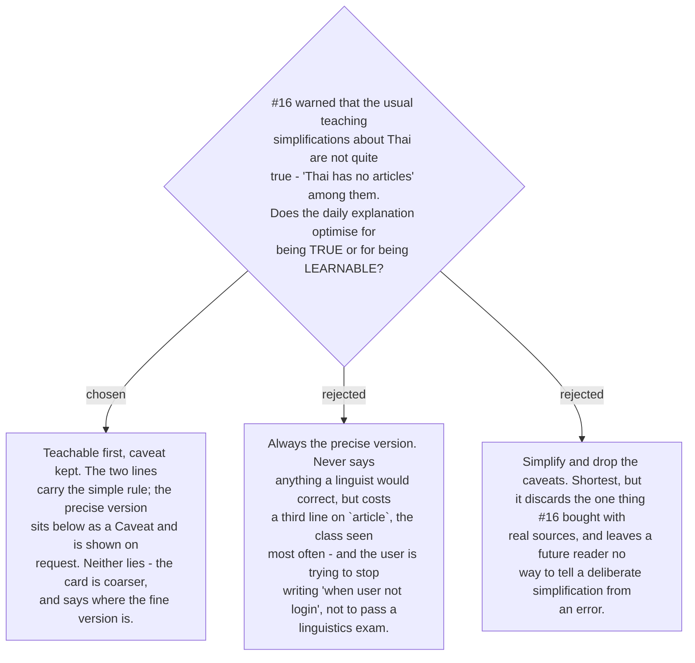

# Explanations are teachable first, with the precise version kept

The research on ticket #16 was specific about this trap. *"Thai has no articles"* is the
sentence every teaching source uses and it is not quite true: Thai has no definite article
and no obligatory article, but `หนึ่ง` + classifier behaves closely like an indefinite one
(Chaiphet 2023). The same holds for tense — Thai marks **aspect**, not tense, and calling
`แล้ว` a past marker is a simplification that hides the mechanism.

A card read many times a day cannot carry that precision on every line, and a card that
drops it entirely loses the only part of #16 that was bought with real sources. So the two
are separated by **where they sit**, not by which is written down. The two-line explanation
carries the rule the user can hold. A `Caveat` beneath it carries the precise version and
its source, and is shown only when asked — the same on-demand path
[ADR 0186](workflow-daily-work-0186-a-collapsed-explanation-expands-on-demand.md) already
built for collapsed explanations.

A caveat exists **only where the teachable line is knowingly coarser than the truth** —
four of the nine, at the time of writing. Where there is none, the two lines are accurate
as they stand, and that absence is itself information: it tells a later reader that nobody
simplified anything there.

## Two authorities, and a dispute must name which one it is invoking

This ADR also settles the ticket's last question. There is no single arbiter, because two
different kinds of claim are being made:

- **Whether the Thai reads naturally** — the **user** decides. They are the native speaker;
  no source outranks them on voice, phrasing or what sounds like a textbook.
- **Whether the claim about Thai is true** — the **cited source** decides. A sentence that
  reads beautifully and misstates how Thai works is still wrong, and #16's bibliography is
  where that is settled.

A correction to this file therefore names which of the two it is, because the remedies
differ: the first is a rewrite, the second is a caveat or a retraction. The nine sentences
as first written were reviewed by the user under exactly this rule and confirmed to read
naturally.
