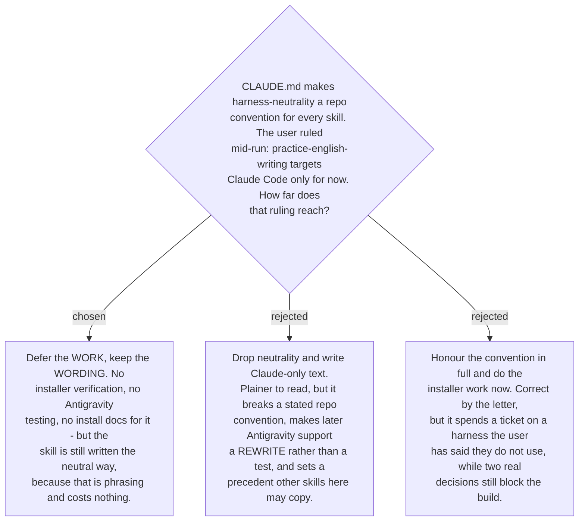

# Antigravity support is deferred, but neutral wording is kept

The user ruled during execution that `practice-english-writing` targets Claude Code only
for now. [CLAUDE.md](../../CLAUDE.md) states the opposite as a convention — *"Skills must
stay harness-neutral (Claude Code + Antigravity)"* — and the map carries the same as a
standing note, so the ruling is a deliberate deviation and is recorded here rather than
left in a session transcript.

The ruling splits cleanly, and the split is what makes it cheap:

- **The work is deferred.** Verifying `install-antigravity.py`'s `rewrite_plugin_root()`
  against this skill's path shapes, testing on Antigravity, and writing its install
  instructions are all out of scope. Ticket #29 closes on this ADR without being done.
- **The wording is not.** The skill still names *actions* rather than one harness's tools
  — "load the skill via your harness's mechanism", not "call the Skill tool" — and still
  confines `${CLAUDE_PLUGIN_ROOT}` to the three shapes the installer rewrites.

Neutral wording survives because it is **phrasing, not machinery**. It costs nothing to
write and nothing to carry, and it is what turns future Antigravity support into a testing
job instead of a rewrite. Dropping it would have bought a slightly plainer sentence and
sold the option to support a second harness cheaply — a bad trade at any price, and worse
here because other skills in this repo would have a precedent to copy.

One known question is deferred with it, and is worth naming so it is not lost. The
**Mistake profile** path from
[ADR 0181](workflow-daily-work-0181-the-mistake-profile-is-one-shared-store-outside-the-per-project-memory-dirs.md)
is absolute and sits outside the plugin root, so it is not a plugin-root shape at all and
no rewrite rule covers it. Whether that passes through untouched or needs installer support
is unanswered. It is the first thing to check if Antigravity support is ever taken up.

This ADR narrows CLAUDE.md's harness-neutrality convention for this one skill, in scope of
*work* only. The convention's wording requirement is unchanged and still applies here.
