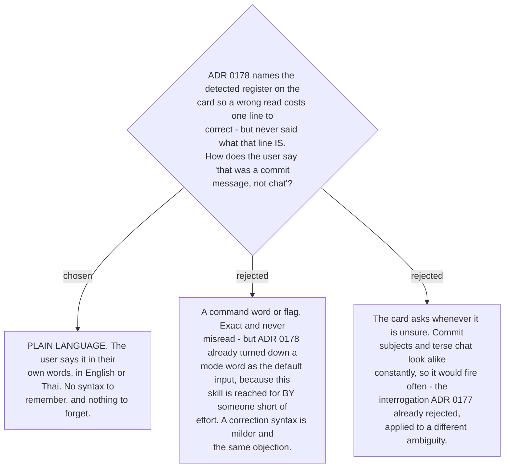

# A register correction is plain language, not a command

The correction is stated the way everything else in this skill is stated: in words. *"That
was a commit message"*, or `อันนี้ commit message`. No flag, no mode word, no slash form.

The reasoning is
[ADR 0178](workflow-daily-work-0178-the-target-register-is-detected-per-message-not-fixed.md)'s,
applied one step further. That ADR rejected making the user declare the register up front,
because the skill exists for someone for whom writing English is already effort, and a word
you must remember is more of it. A correction syntax is a milder version of the same tax —
paid only when a read is wrong — but it is the same tax, and there is no reason to charge
it when the skill can simply understand the sentence.

**One ambiguity this creates, and it is handled by an existing rule rather than a new one.**
"That was a commit message" is both a plausible correction *and* a plausible message the
user wants corrected. The skill reads it as a correction when it names a register and
immediately follows a card; otherwise it is ordinary input. Where that is genuinely
unclear, [ADR 0177](workflow-daily-work-0177-unrecoverable-meaning-is-guessed-and-flagged-unless-the-guess-changes-scope.md)
already says what to do: guess the likely reading and flag the guess. This case does not
meet 0177's carve-out — guessing wrong costs one more line, not the scope of an
instruction — so it guesses rather than asks.
