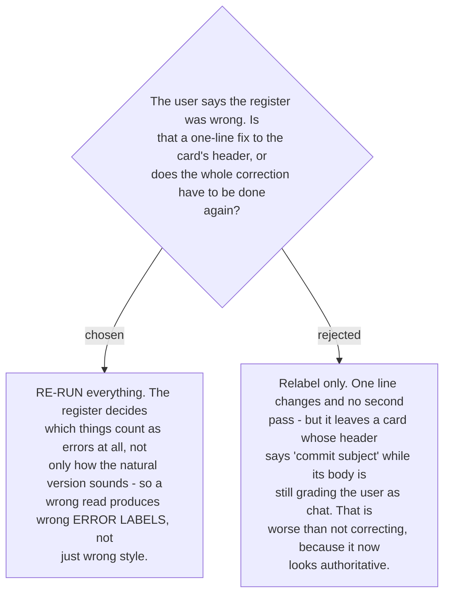

# A register correction re-runs the correction rather than relabelling it

A register is not a cosmetic tag on the output. It decides **which classes apply**, which
is the whole content of
[ADR 0178](workflow-daily-work-0178-the-target-register-is-detected-per-message-not-fixed.md).

The concrete case makes it plain. `fix login bug on expired token` read as **chat** is
reported as an `article` error — *"fix **the** login bug"* — and a `verb-tense` error —
*"I **fixed**"*. Read as a **commit subject**, neither is an error: an article-less
imperative is correct commit style, and only `capitalisation` genuinely applies. A relabel
would flip the header to "commit subject" and leave both false labels sitting underneath it.

So the correction re-runs from the original text under the stated register, producing a new
minimal fix, new error labels and a new natural version. The cost is one extra pass over a
short message; the alternative is a card that is confidently wrong, which is the one output
a teaching skill cannot afford.

The user's stated register wins outright over the detector on the re-run. They said it; the
detector guessed.
