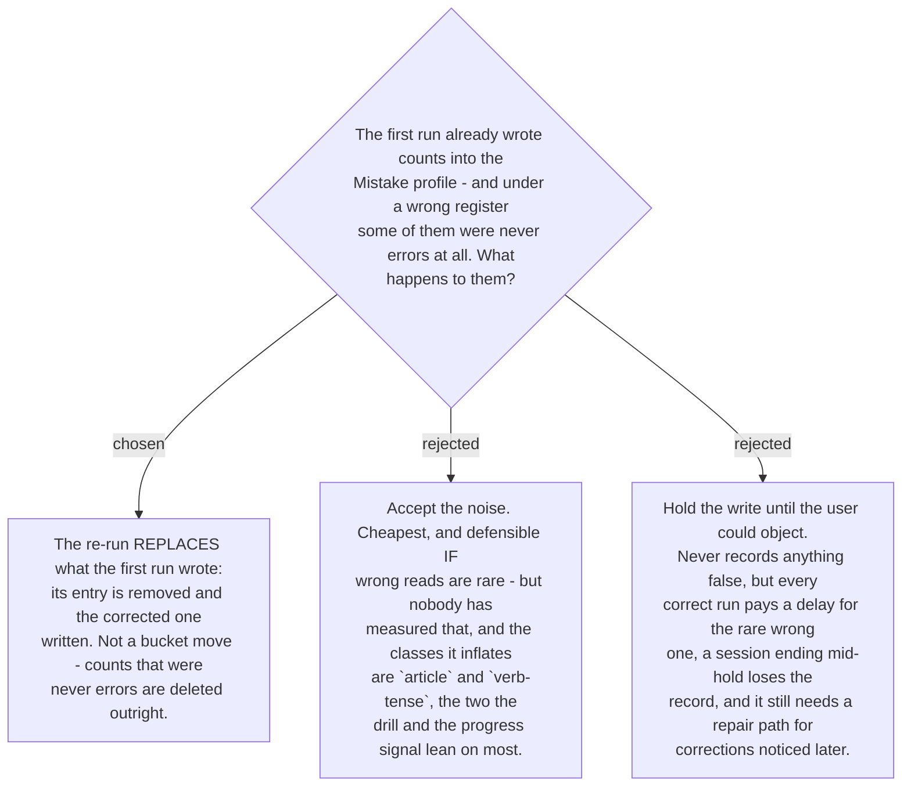

# The re-run replaces the profile entry the first run wrote

Under a wrong register the first run does not merely file counts in the wrong bucket — it
files counts that should not exist. `fix login bug on expired token` misread as chat records
an `article` error and a `verb-tense` error against a message that contained neither. Moving
those to the `commit` bucket would be as wrong as leaving them in `chat`; they have to go.

That is why the accept-the-noise option loses despite being the cheapest and being flagged
as defensible on the ticket itself. It rests on wrong reads being rare, which nobody has
measured, and it inflates precisely the two classes that
[ADR 0182](workflow-daily-work-0182-the-profile-holds-counts-and-a-capped-sample-not-a-log.md)'s
consumers depend on most. The profile is what #16 said must override the published ranking;
counts the user never earned corrupt exactly the thing it exists to be.

The mechanism needs nothing new. The re-run already produces the correct set of errors, and
the skill knows what it wrote a moment earlier, so it removes that entry and writes the
corrected one. No schema field, no undo log.

**The bound, stated rather than papered over.** Repair is possible only while the original
write is still in the conversation. If the session ends and the user notices the wrong
register the next day, the counts stand — the skill has no record of which write to undo,
and inventing one would mean the per-correction log
[ADR 0182](workflow-daily-work-0182-the-profile-holds-counts-and-a-capped-sample-not-a-log.md)
deliberately refused. In that case the remedy is the one already available: the profile is
Markdown the user can edit by hand
([ADR 0183](workflow-daily-work-0183-the-profile-is-markdown-because-its-reader-is-a-model.md)).
That is a real limit, and it is the correct place to stop.
