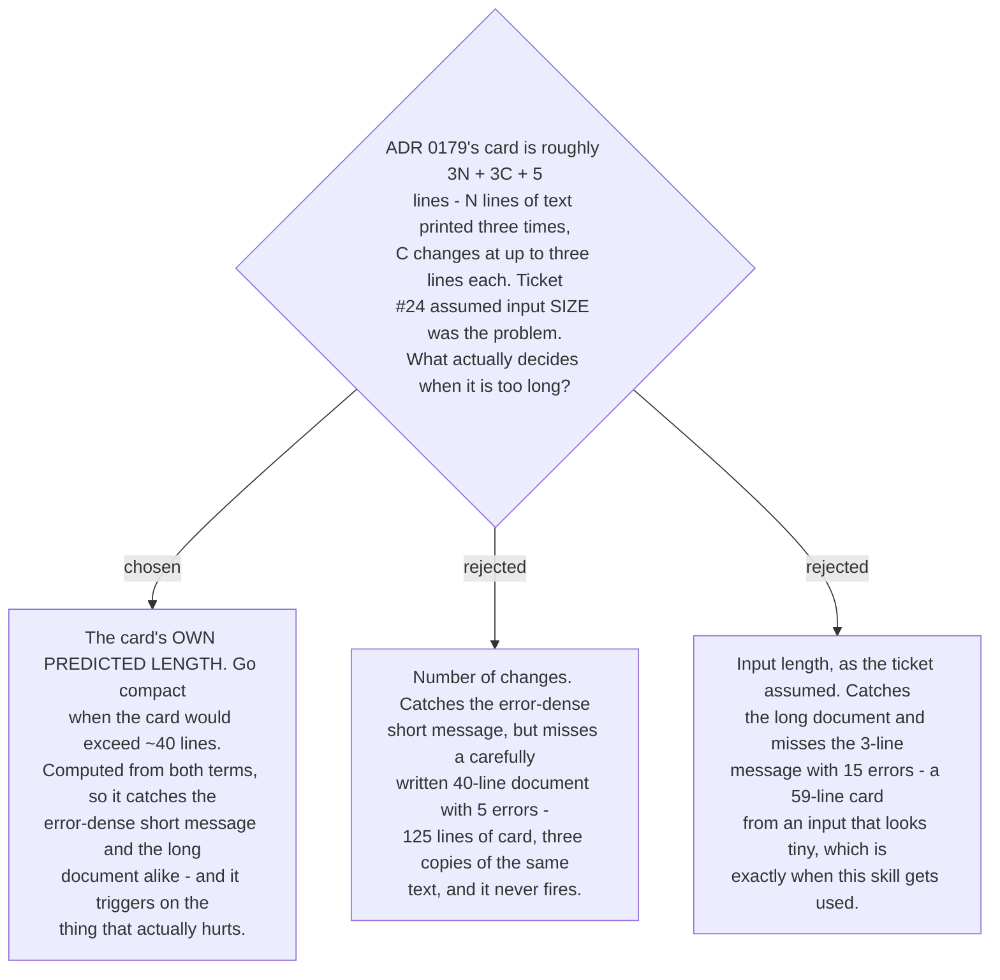

# The compact card triggers on predicted card length, not input size

The ticket was written around input size, and the arithmetic does not support it. The card
is approximately **3N + 3C + 5**: the user's text appears three times — echoed, corrected,
and as the natural version — and each change costs up to three lines while its explanation
is still in full form.

| input | N | C | card |
|---|---|---|---|
| one sentence | 3 | 6 | 32 lines — matches ADR 0179's figure |
| short, error-dense | 3 | 15 | 59 lines |
| PR description, explanations collapsed | 14 | 23 | 70 lines |
| PR description, day one | 14 | 23 | 116 lines |

A three-line input produces a fifty-nine-line card. Neither term predicts the problem on
its own; the sum does. So the trigger is the sum: **the card goes compact when its predicted
length exceeds roughly forty lines.**

Two properties make this the right variable rather than merely a workable one.

**It is self-adjusting.** [ADR 0184](workflow-daily-work-0184-a-class-explanation-collapses-after-n-and-returns-on-relapse.md)
collapses explanations after ten exposure-days, which drops each change from three lines to
one. The same input that triggered compact mode in week one stops triggering it in month
two, without any rule saying so. The card gets shorter as the user gets better, which is the
behaviour the whole skill is arguing for.

**It measures the harm directly.** Input length and change count are both proxies for "the
card is too long to read". Predicted length is the thing itself.

The forty-line threshold is a **stated value, not a derived one** — the same treatment
ADR 0184 gave its ten days and fourteen days. It is written where it can be read and
changed, and the skill says which value it used.
