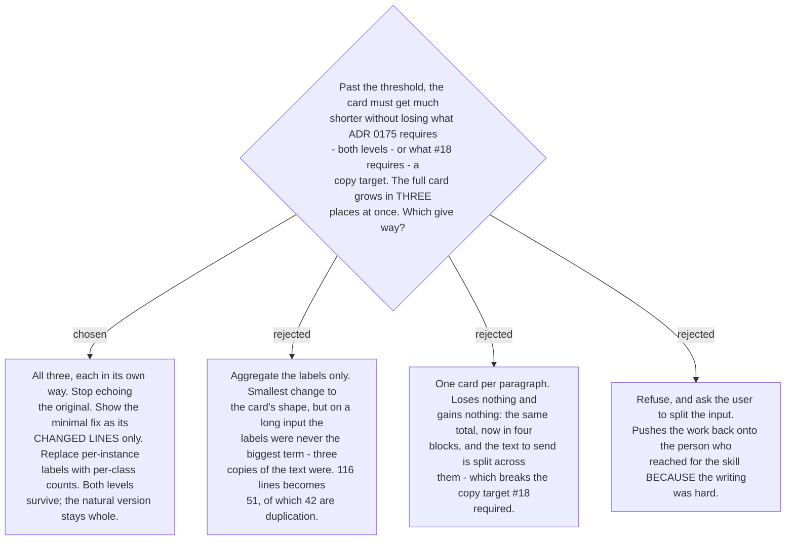

# The compact card drops the echo, diffs the fix, and aggregates the labels

Each of the three terms is cut by the thing that makes it redundant rather than by a blanket
truncation:

- **The echo goes.** The user's original is one scroll away in their own message. It is the
  only part of the card that carries no new information at all.
- **The minimal fix becomes a diff of its changed lines**, not a full reprint. Its job is to
  show what was wrong; the whole corrected text is already visible in the natural version
  below it.
- **Per-instance labels become per-class counts** — `article ×9 · sv-agreement ×7 ·
  verb-tense ×4 · capitalisation ×3`. This is the shape the **Mistake profile** already
  stores, so the summary is native rather than invented.

The natural version stays **whole**, because it is the text the user actually sends, and
#18 made the copy target a requirement.

On the worked example — a PR description, N=14, C=23 — this takes the card from **116 lines
to about 28**.

**The order is unchanged, and that matters.**
[ADR 0179](workflow-daily-work-0179-the-correction-card-is-lesson-first-and-explains-every-change.md)
chose lesson-first so the eye passes through the correction on its way to the answer. The
compact card keeps that: what was wrong comes first, the natural version last. Only the
redundancy is removed, never the ordering that carries the pedagogy.

**Amends ADR 0179**, which called the card a fixed format. It has two forms — full and
compact — selected by
[ADR 0194](workflow-daily-work-0194-the-compact-card-triggers-on-predicted-length-not-input-size.md)'s
predicted-length rule. Both are fixed; neither is free prose.
