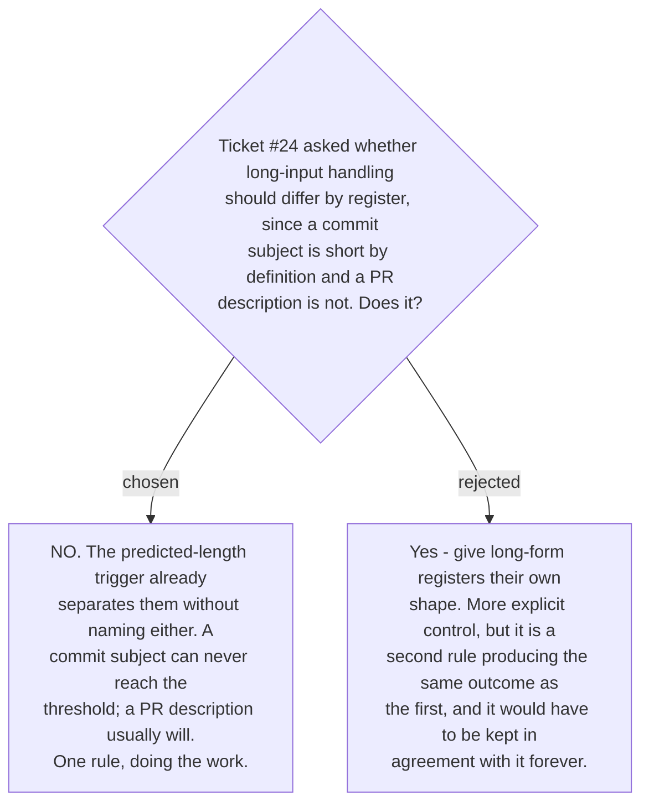

# No per-register rule for long input

This is a deliberate no, recorded because the ticket asked the question and a later reader
would otherwise wonder whether it was considered.

The register-specific rule would be doing arithmetic the threshold already does.
[ADR 0194](workflow-daily-work-0194-the-compact-card-triggers-on-predicted-length-not-input-size.md)
predicts the card's length from the text and the changes; a one-line commit subject cannot
produce a forty-line card, and a fourteen-line PR description usually does. Adding a
register clause would restate that outcome in a second place, where it could drift out of
agreement with the first.

It would also be the wrong shape of rule. **Register decides which classes count as errors**
— that is
[ADR 0178](workflow-daily-work-0178-the-target-register-is-detected-per-message-not-fixed.md)'s
job and it is about correctness. **Length decides how much of the result fits on screen** —
a presentation concern. Coupling them would make a change to one register's grammar rules a
change to its layout, for no reason.

The register is still **named on the compact card**, exactly as on the full one. It is
reported, not consulted.
