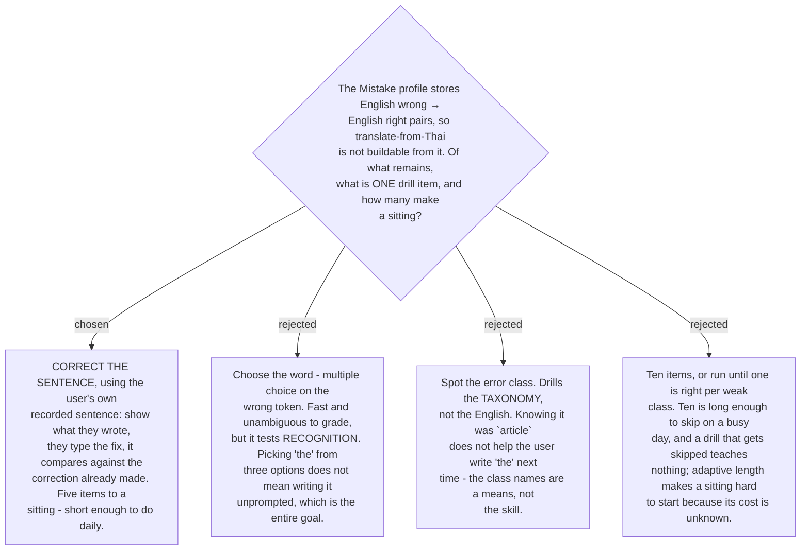

# A drill item is correct-the-sentence, and a sitting is five

The profile's samples are **English wrong → English right** pairs
([ADR 0182](workflow-daily-work-0182-the-profile-holds-counts-and-a-capped-sample-not-a-log.md)),
with no Thai source retained, so a translate-from-Thai item cannot be built from what
exists. That narrows the field before any preference is applied.

Among what is left, **production beats recognition**. The skill exists so the user writes
correct English unprompted; a multiple choice tests whether they can pick the right answer
from three, which is a different and easier thing. So an item shows a real sentence they
wrote, and they type the correction.

**A sitting is five items.** Short sessions repeated often beat long ones, and
[ADR 0184](workflow-daily-work-0184-a-class-explanation-collapses-after-n-and-returns-on-relapse.md)
already spaces exposure by *distinct day*, which a daily five fits and a fortnightly twenty
does not. Five is a **stated, tunable number**, exactly like the ten exposure-days, the
fourteen-day relapse gap and the forty-line threshold — none of the four rests on evidence,
and all four are written where they can be changed.

**One honest weakness, and its mitigation.** Drilling the user's own sentence risks
**recall rather than knowledge**: they have seen this exact correction before and may
reproduce it from memory. The mitigation costs nothing and needs no new number — **draw the
oldest samples in the FIFO first.** The sample most likely to be remembered is the one
added most recently, so preferring old ones both maximises the gap and empties the buffer
in the order it filled.
